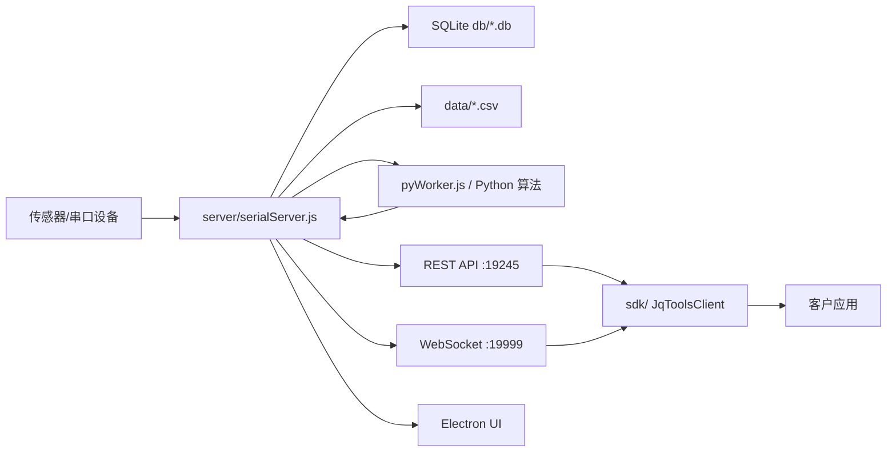

# 项目架构

最后更新于：2026-07-07

## 概览

- Electron 桌面应用（入口：`index.js`）启动本地 UI、Node.js 串口/HTTP/WS 服务和 Python 算法进程。
- Node.js 服务负责串口采集、SQLite 存储与回放，并桥接 Python 算法。
- Python 层通过 stdin/stdout 的 JSON 行协议提供算法能力。
- 前端资源由 Electron 内置的本地 HTTP 服务提供（`build/`）。
- 新增 `sdk/` 客户端 SDK，封装本地后端 REST API 和 WebSocket 实时数据流，供客户应用调用。
- 汽车自适应数据帧（144 字节）会调用 Python 算法包，并将 `control_command` 写回对应的 `carAir` 串口。
- 新增 `dotnet-wrapper/` WPF 自定义控件库，编译后输出 DLL，客户 WPF 程序可直接嵌入现有调试页面。
- 新增 `native-dll/` 标准 C/C++ Native DLL 方案，WPF 可通过 P/Invoke 启动调试服务并加载调试页面。

## 技术栈

- Electron 31
- Node.js / CommonJS
- Express 5
- WebSocket (`ws`)
- SerialPort 13
- SQLite3
- Python 常驻 worker
- SDK：Node.js 18+，原生 `fetch`，`ws`
- .NET 8 WPF 自定义控件库
- WebView2 WPF 控件
- C++17 Native DLL
- WinHTTP / ShellExecute Windows API

## 目录结构

```text
D:\jqtoolsWin1
├── index.js                 # Electron 主进程、本地 UI 静态服务、后端子进程启动
├── server/
│   ├── serialServer.js      # REST API、WebSocket、串口采集、存储、Python 桥接
│   └── HttpResult.js        # 统一响应结构
├── util/                    # 串口、数据库、解析、配置、加密等工具
├── pyWorker.js              # Python worker 调用桥接
├── python/                  # Python 算法与运行环境
├── db/                      # SQLite 数据库
├── data/                    # CSV 数据输出
├── build/                   # 前端构建产物
└── sdk/                     # 客户端 SDK 包
    ├── package.json
    ├── index.js
    ├── index.d.ts
    └── README.md
└── dotnet-wrapper/
    └── JqTools.CarAdaptive.Wpf/ # WPF Custom Control Library，输出 DLL 并嵌入调试页
└── native-dll/
    └── JqToolsCarAdaptiveNative/ # 标准 C/C++ Native DLL，供 WPF P/Invoke 加载
```

## 运行时组件

1. Electron 主进程
   - 入口：`index.js`
   - fork 子进程启动 API：`server/serialServer.js`
   - 启动 Python worker：`pyWorker.js`
   - 在 `http://127.0.0.1:2999` 提供 `build/` 静态资源
   - 打开 BrowserWindow 加载本地 UI

2. Node.js API + 串口服务
   - 入口：`server/serialServer.js`
   - Express REST API：端口 `19245`
   - WebSocket：端口 `19999`
   - 串口采集（serialport），解析传感器帧
   - SQLite 存储在 `db/`（打包后 `resources/db`）
   - CSV 导出到 `data/`（打包后 `resources/data`）
   - 通过 `callPy()` 调用 Python 算法（`pyWorker.js`）

3. Python Worker + 算法
   - 使用按行 JSON 请求/响应：
     - 请求：`{"id":"...","fn":"...","args":{...}}`
     - 响应：`{"id":"...","ok":true,"data":...}`
   - 由 Node.js 侧 `callPy()` 调用。
   - 汽车自适应链路调用 `callPy('server', { sensor_data })`，算法返回的 `control_command` 按字节写入串口。

4. 客户端 SDK
   - 目录：`sdk/`
   - 包名：`@jqtools/client-sdk`
   - 默认 REST 地址：`http://127.0.0.1:19245`
   - 默认 WS 地址：`ws://127.0.0.1:19999`
   - 暴露 `JqToolsClient` / `createClient()`，封装系统、串口、采集、历史、回放、配置和实时订阅能力。

5. WPF 自定义控件 DLL
   - 目录：`dotnet-wrapper/JqTools.CarAdaptive.Wpf/`
   - 输出：`JqTools.CarAdaptive.Wpf.dll`
   - `CarAdaptiveDebugControl` 使用 WebView2 加载 `mock-sdk` 调试页面。
   - `CarAdaptiveMockServiceHost` 负责启动 `mock-service.js`，并注入 HTTP/WS 端口环境变量。
   - 项目构建时会复制 `mock-sdk` 页面、Node 服务和 `ws` 依赖到应用输出目录。

6. C/C++ Native DLL
   - 目录：`native-dll/JqToolsCarAdaptiveNative/`
   - 输出：`JqToolsCarAdaptiveNative.dll`
   - 导出 `JqCarAdaptiveStart`、`JqCarAdaptiveStop`、`JqCarAdaptiveGetDebugUrl` 等 C ABI 函数。
   - WPF 使用 `DllImport` 调用 Native DLL，启动 `mock-sdk` 服务后用 WebView2 加载返回的调试页 URL。
   - CMake 构建后会复制 `mock-sdk` 页面、Node 服务和 `ws` 依赖到 DLL 输出目录。

## API 端点

REST API（`server/serialServer.js`）：

- `GET /`
- `POST /bindKey`
- `POST /selectSystem?file=...`
- `GET /getSystem`
- `GET /getPort`
- `GET /connPort`
- `POST /startCol`
- `GET /endCol`
- `GET /getColHistory`
- `POST /downlaod`
- `POST /delete`
- `POST /changeDbName`
- `POST /getDbHistory`
- `POST /getContrastData`
- `POST /changeDbDataName`
- `POST /cancalDbPlay`
- `POST /getDbHistoryPlay`
- `POST /changeDbplaySpeed`
- `POST /changeSystemType`
- `POST /getDbHistoryStop`
- `POST /getDbHistoryIndex`
- `POST /getCsvData`
- `GET /sendMac`
- `POST /getSysconfig`
- `GET /getPyConfig`
- `POST /changePy`
- `POST /carAdaptive/processFrame`
- SDK 注释：`sdk/index.js` 和 `sdk/index.d.ts` 的客户侧 API 说明已改为中文注释。
- SDK 注释：`PythonAlgorithmWorker` 和 SDK 内部工具函数已补充中文说明，确保每个函数都有注释。
- SDK 服务：新增 `sdk/service.js`，SDK 可直接启动 HTTP 服务和 WebSocket 服务，客户通过接口调用汽车自适应算法、Python 参数和串口代理操作。
- SDK 调试页：新增 `sdk/debug.html`，通过 `/debug` 打开，可调试健康检查、串口代理、144 点算法调用、Python 参数和 WebSocket 实时消息。
- SDK 假数据调试版：新增 `sdk/mock-service.js` 和 `sdk/mock-debug.html`，只启动 HTTP/WS 两个服务，支持一键假连接、假传感器流、假算法数据、气囊控制回包和自适应开关。
- SDK 假数据调试版：已拆分到独立目录 `mock-sdk/`，和正式 `sdk/` 服务目录分离。
- SDK 假串口调试：`mock-sdk/` 一键假连接后会立即通过 WebSocket 推送 `type: "serial"` 假串口帧，并提供 `GET /fake/serialFrame` 手动获取一帧 144 点 `carAir` 数据。
- SDK 假算法调试：`mock-sdk/` 每帧假串口数据都会同步推送 `type: "algorithm"` 假算法结果，包含 144 点压力数据和 51 字节控制数据，并在调试页可视化展示。
- WPF 调试控件库：新增 `dotnet-wrapper/JqTools.CarAdaptive.Wpf`，以 DLL 形式封装当前调试页面，支持 WPF 应用内嵌和自动启动假数据服务。
- Native DLL 调试封装：新增 `native-dll/JqToolsCarAdaptiveNative`，以标准 C/C++ DLL 形式导出启动、停止、状态、URL 和打开页面函数，供 WPF P/Invoke 加载。

WebSocket（端口 `19999`）推送实时消息，常见字段包括 `sitData`、`data`、`macInfo`、`algorData`、`algorFeed`、`playEnd`、`contrastData`。

## 数据流



## 环境与配置

- `config.txt`：AES-ECB 加密配置，由 `server/serialServer.js` 读取解密。
- `util/config.js`：运行时常量（波特率、类型映射、帧分隔符等）。
- 打包模式下资源路径位于 `resources/db`、`resources/data`、`resources/python`。

## 更新日志

| 日期 | 类型 | 说明 |
| --- | --- | --- |
| 2026-07-06 | 新增功能 | 新增客户侧 `sdk/` 包，封装后端 REST API 与 WebSocket 实时数据流 |
| 2026-07-06 | 修复缺陷 | 补齐 `/selectSystem`、`/changeDbDataName`、`/getCsvData` 的响应和异步处理，避免 SDK 调用超时或返回空对象 |
| 2026-07-06 | 新增功能 | 接通汽车自适应算法输出到串口写入链路，将 `control_command` 写回 `carAir` 设备串口 |
| 2026-07-06 | 文档更新 | 为 SDK 源码和类型声明补充客户调用注释 |
| 2026-07-06 | 修复缺陷 | 修复 `mock-sdk/` 一键假连接后页面看不到假串口数据的问题，补充 `serialData`、`sitData.carAir` 和 `data.carAir` 推送 |
| 2026-07-06 | 新增功能 | 扩展 `mock-sdk/` 假算法推送，补充 144 点压力数据、51 字节控制数据和调试页可视化 |
| 2026-07-07 | 新增功能 | 新增 WPF 自定义控件库封装，输出 DLL 后可在客户 WPF 程序中嵌入汽车自适应调试页面 |
| 2026-07-07 | 新增功能 | 新增标准 C/C++ Native DLL 封装，WPF 可通过 P/Invoke 启动调试服务并加载现有前端页面 |

## 项目进度

| 日期 | 工作 | 说明 |
| --- | --- | --- |
| 2026-07-06 | 客户端 SDK 输出 | 创建 `@jqtools/client-sdk`，支持系统、串口、采集、历史、回放、配置和实时订阅调用 |
| 2026-07-06 | 后端 SDK 适配 | 修复客户调用链路中的无响应接口和 CSV 异步读取问题 |
| 2026-07-06 | 汽车自适应串口控制 | 144 字节汽车自适应帧触发 Python 算法，后端定时将算法控制指令写入目标串口 |
| 2026-07-06 | SDK 注释补充 | 为 SDK 对外配置、方法、错误类型和实时订阅回调增加说明注释 |
| 2026-07-06 | 假串口调试链路 | `mock-sdk/` 一键连接会自动接入 WS 并持续输出 144 点假串口帧，调试页可直接看到 frameCount 增长 |
| 2026-07-06 | 假算法数据可视化 | `mock-sdk/` 持续输出压力图、生命检测、体型、座椅状态、自适应调节和 51 字节控制命令，并在调试页显示矩阵 |
| 2026-07-07 | WPF DLL 封装 | 创建 `JqTools.CarAdaptive.Wpf` 控件库，提供 `CarAdaptiveDebugControl` 和 `CarAdaptiveMockServiceHost` |
| 2026-07-07 | Native DLL 封装 | 创建 `JqToolsCarAdaptiveNative` 标准 C/C++ DLL，提供 C ABI 导出函数和 WPF P/Invoke 示例 |
| 2026-07-07 | WPF 客户启动程序 | 创建 `JqTools.CarAdaptive.ClientWpf`，客户可直接运行 EXE，自动启动内置数据服务并加载调试界面 |
## 环境安装记录

| 日期 | 类型 | 说明 |
| --- | --- | --- |
| 2026-07-07 | 配置变更 | 安装并验证 .NET 8 SDK、CMake、WebView2 Runtime、VS Build Tools C++、Node 依赖和 Python 算法依赖；修复 WPF DLL 构建缺失的 `System.IO` 引用。 |
| 2026-07-07 | 构建验证 | WPF DLL 和 Native DLL 已完成 Release 构建，`sdk/` 与 `mock-sdk/` 已安装 Node 依赖，Python 算法 `requirements.txt` 已确认可用。 |
| 2026-07-07 | 文档更新 | 新增 `netsdk/README.md`，说明新前端、后端、算法、调试页修改后的构建、验证和交付目录输出流程。 |
| 2026-07-07 | 配置变更 | 新增 `netsdk/build-netsdk.ps1`，一键构建并输出 WPF UI 控件、Native DLL、正式 SDK 服务和假数据调试服务四套交付物。 |
| 2026-07-07 | 配置变更 | 新增 `netsdk/build-mock-only.ps1` 和 `netsdk/mock-only/`，单独输出假数据链路验证包，包含假数据服务、WPF UI 控件和 Native DLL。 |
| 2026-07-07 | 缺陷修复 | WPF 控件增加应用退出和 Dispatcher 关闭时自动停止假数据服务；Native WPF 包装类增加 ProcessExit 兜底停止逻辑。 |
| 2026-07-07 | 配置变更 | 新增 `netsdk/build-data-dll-kit.ps1` 和 `netsdk/data-dll-kit/`，单独输出数据服务、调试 Web、WPF DLL、Native DLL 以及启动/停止脚本。 |
| 2026-07-07 | 新增功能 | 新增客户可直接启动的 WPF 程序输出 `netsdk/data-dll-kit/wpf-app/` 和 `start-wpf.ps1`，并支持复用已运行的数据服务。 |
| 2026-07-07 | 文档更新 | 新增 `netsdk/data-dll-kit/FAKE_API.md`，记录假数据 HTTP 接口、WebSocket 推送、144 点压力数据和 51 字节控制命令格式。 |
| 2026-07-07 | 协议修正 | 将假数据 WebSocket 推送改为真实后端协议格式：连接初始 `{}`，串口 `{ sitData }`，算法 `{ algorData }`，反馈 `{ algorFeed }`。 |
| 2026-07-07 | 配置变更 | 新增 `netsdk/build-customer-sdk.ps1` 和 `netsdk/customer-sdk/`，输出客户可直接运行的 WPF SDK、真实协议假数据服务、WPF/Native DLL、接口文档和验收脚本。 |
# 2026-07-10 更新

- `netsdk/customer-sdk/` 已集成当前 `build/` 真实前端和 Three.js 模型资源。
- 前端资源统一输出到 `netsdk/customer-sdk/frontend-build/`，避免 `.glb`、`.fbx` 等大模型被重复复制。
- WPF 启动程序、WPF 控件、独立 `mock-service` 和 Native DLL 都通过共享前端目录加载 `/app`，继续使用真实协议假数据服务。
- 新增 `netsdk/customer-sdk/docs/REAL_ARCHITECTURE.md`，说明真实项目架构、客户 SDK 架构，以及真实前端、真实协议、WPF、Native DLL 的转换关系。
- `netsdk/customer-sdk/` 默认启动入口已切换为真实数据模式：兼容旧文件名 `mock-service.js`，实际 fork `server/serialServer.js`，读取真实串口、调用 `pyWorker.js/Python`，并通过 `/app` 加载真实前端。
