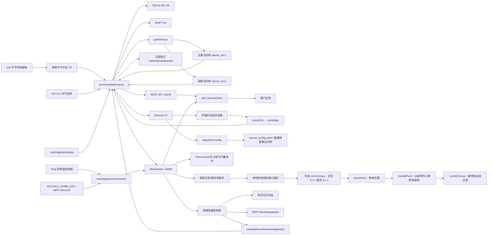

# 项目架构

最后更新于：2026-08-19

## 概览

- Electron 桌面应用（入口：`index.js`）启动本地 UI、Node.js 串口/HTTP/WS 服务和 Python 算法进程。
- Node.js 服务负责串口采集、SQLite 存储与回放，并桥接 Python 算法。
- Python 层通过 stdin/stdout 的 JSON 行协议提供算法能力。
- 前端资源由 Electron 内置的本地 HTTP 服务提供（`build/`）。
- 新增 `sdk/` 客户端 SDK，封装本地后端 REST API 和 WebSocket 实时数据流，供客户应用调用。
- 汽车自适应串口帧为 145 字节：首字节是主副传感器标识，后 144 字节分别进入两套独立 Python 算法，并将两路 `control_command` 排队写回对应的 `carAir` 串口。
- 每块靠背或坐垫保持 72 点，物理布局为两个宽 1、高 4 的侧翼和一个 `8×8` 中心区，即 `4 + 4 + 64`；Three.js、原始数据页和 Python 算法共用相同索引边界。
- Three.js 压力点插值支持单列侧翼，`1×4` 数据沿高度方向连续插值后再完整补齐左右边界；区域调节中的座椅图和全部气囊使用同一个垂直居中的定位容器。
- 单列侧翼在二维高斯平滑后按当前半径补偿横向零边框造成的固定衰减，使 `1×4` 侧翼与 `8×8` 中间区域使用相同的绝对压力颜色刻度，同时保留侧翼边缘渐变。
- 自适应座椅 `carAir` 的默认颜色上限为 `616`；该值同时保存在前端系统设置默认项和后端加密 `config.txt` 中，由 `/getSystem` 在页面启动时下发。
- 视图调节对座椅模型、全部点图、单个点图和整体视图提供独立 `SX/SY/SZ` 缩放，旧版统一缩放值在读取时自动迁移为三轴配置；整体旋转和缩放通过座椅包围盒中心枢轴执行。
- 当前整体视图默认值为 `X=154/Y=-62/Z=-43/RX=-6.64/RY=-6.86/RZ=-6.35`，靠背点图默认 `Z=250.5`；配置存储键升级到 `jqtools.carAir.sceneTransform.v7`，页面中央不再显示“自适应调节”图片标识。
- 新增 `dotnet-wrapper/` WPF 自定义控件库，编译后输出 DLL，客户 WPF 程序可直接嵌入现有调试页面。
- WPF 真实服务启动等待默认从 8 秒延长到 30 秒，并可通过 `StartupTimeoutSeconds` 配置；汽车自适应模块首次挂载、路由返回、远程 `open-module` 和 WebView 隐藏后恢复都会重新执行 `/connPort`、`/sendMac`，并发重连由前端共享请求锁合并。
- 新增 `native-dll/` 标准 C/C++ Native DLL 方案，WPF 可通过 P/Invoke 启动调试服务并加载调试页面。
- `netsdk/customer-sdk/` 已改为独立真实数据交付包，第一方 Node 业务代码交付为 SEA 宿主加 AES-256-GCM 加密包，第一方 Python 算法交付为 sourceless `.pyc`，不再暴露后端业务源码。
- 客户 SDK 仅交付 `docs/API.md` 和 `docs/QUICKSTART.md`，只记录当前汽车 SDK 业务实际使用的启动、串口、算法、55 字节控制命令、采集、远程控制和 WebSocket 接口。
- 保护清单同时记录 `backend-host.exe` 和 `backend.jqpack` 的 SHA-256；真实服务及验收脚本均在启动前校验这对文件，阻止增量覆盖导致的 AES 密钥不匹配。
- 新电脑运行 WPF 需要 .NET 8 Desktop Runtime 和 WebView2 Runtime；Node.js 与 Python 随客户 SDK 交付，无硬件验收和 WPF 冒烟测试由 `scripts/verify-sdk.ps1` 统一执行。
- 汽车前端新增算法参数抽屉，通过 HTTP 批量修改 YAML 参数并重建常驻 Python 算法实例。
- 气囊控制模式为主、副驾独立三态：`GET`/`POST /carAdaptive/mode` 带 `sensorId` 时只修改目标通道，不传时兼容旧客户端并同时修改两路。`manual` 只停该路自动写串口，`paused` 只停该路算法；恢复时 Python `resetMessage/resetSystem` 都带目标 `sensor_id`。状态通过 `carAdaptiveControlMode.sensors` 和每路快照广播。
- 控制模式跟随 SDK 页面视图自动切换：`host-home` 和其他宿主视图暂停两路，`module` 分别恢复每路暂停前的 `auto/manual`；`raw-serial` 是只读观察页，不改变算法模式。触发点为 `POST /carAdaptive/ui/command` 和 WebSocket `carAdaptiveUiReport`。
- 气囊展示状态按固定归属合并：`POST /carAdaptive/display` 独占 3、4、5、6 号，未设置或 `DELETE /carAdaptive/display/:sensorId` 清除后四路固定为 `0`；ECU 和可选命令回落中的 3–6 号始终被忽略，1、2、7–24 号持续采用 ECU 回传或回落状态。`feedbackOnline` 始终只表示真实 ECU 回传，API 展示状态不会伪造 ACK。串口回传的 51 字节业务帧同时保留还原后的 55 字节诊断帧。
- 区域调节面板通过 `client/src/airComponents/aside/airAsideDisplayData.js` 独立组装合并后的 24 路展示档位；气囊点亮不再依赖 `algorData` 是否已经产出，因此算法未就绪或传感器离线时，`POST /carAdaptive/display` 的 3–6 号接口覆盖仍会立即显示。
- 局域网 `#/remote-control` 调试页提供主副驾与页面跳转、气囊三态模式、3/4/5/6 号手动档位、保持/放气预设、通道在线与回传状态；气囊目标通道独立于显示通道。
- 新增 `#/api-debug` 真实接口工作台，集中调试 HTTP/WS、串口、主副驾独立模式、展示覆盖和远程页面命令，并保留请求/响应记录；真实串口控制面和 UI 展示控制面都只开放 3、4、5、6 号。`POST /carAdaptive/writeCommand` 后端强制校验完整 55 字节协议和非零档位白名单，`POST /carAdaptive/display` 只替换四路界面状态；算法内部完整 24 路通过独立调用链写入，不受手动接口限制。
- 主驾、副驾完整快照通过 `carAdaptiveSensorsData` 同时推送，前端各自缓存并在本地切换展示。
- 双通道页面只使用 `carAdaptiveSensorsData` 更新汽车连接状态；兼容旧协议时会从单路 `sitData` 中移除 `carAir` 和串口尚未识别类型时产生的 `undefined` 状态，避免旧消息覆盖当前主副驾快照并导致“一键连接”和在线状态闪烁。
- 主副驾共用完全相同的 Three.js 内容；外层 `mirrorGroup` 包含保存整体位置的 `sceneRoot` 和以座椅包围盒中心旋转、缩放的 `overallPivot`，并以场景 `X=0` 对应的画布中央纵线为固定镜像轴。切换副驾时仅设置 `mirrorGroup.scale.x = -1`，座椅、整体视图变换和全部压力点同步翻转，外部业务 UI 和 WebGL 画布保持原方向。
- 前端 `#/raw-serial` 串口原始数据页同时提供“压力帧”和“气囊指令”视图：前者显示 145 字节完整帧和 144 点座椅形状，后者分别显示算法生成/下发、ECU 回传、接口写串口和接口展示覆盖；“历史记录”弹窗按主副驾和五类来源筛选服务内存记录，支持完整字节、24 路档位、自动刷新和清空；页面工具栏可直接开始、停止和导出真实数据采集。
- 主界面和原始数据页通过 `client/src/util/carAdaptiveCollection.js` 共用同一套采集 API 与全局采集状态。后端同一时间只允许一个采集任务，启动时固定 `sensorId=1/2`，切换前端展示通道不会改变正在写入 SQLite 的采集通道。
- 原始数据页可通过 `GET /carAdaptive/collection/export` 直接导出 SQLite 采集段；CSV 每帧保留 `sensorId` 和 `p0...p143` 原始字节，不经过 Python 算法、滤波或 Three.js 插值，浏览器和 Node SDK 共用同一下载接口。
- 历史采集兼容层统一处理 SQLite 回放与旧版 CSV 导出：损坏 JSON 行会跳过，单帧使用 `12 Hz` 默认频率，Windows 非法文件名字符会替换；历史 WebSocket 帧带 `carAdaptiveHistoryFrame` 标识，并用 `carAdaptiveHistoryState` 阻止双传感器实时流覆盖回放。
- `netsdk/build-customer-sdk.ps1` 重建客户包时原地保留 `real-backend/db/carAir.db`、`real-backend/data/` 和客户替换的 `frontend-build/model/FAST27-前排座椅.glb`，避免更新程序时覆盖现场数据或座椅模型。
- 客户包构建和验收明确排除 `app/JqTools.CarAdaptive.ClientWpf.exe.WebView2/` 与 `real-backend/node_modules/sqlite3/build-tmp-napi-v6/`；前者是运行 WPF 后产生的浏览器缓存，后者是 npm 安装产生的原生模块编译临时文件，均不属于运行时业务资源。
- 新增局域网模块控制协议和独立 `#/remote-control` 调试页；iPad 使用 `/app?remoteControl=1&showTitle=1` 时加载同一业务前端，已有主副驾控件会广播切换，点击品牌标识会广播返回主页，页面不增加可见控件。
- WPF 控件新增 `HomeUrl` 配置并通过隐藏 WebView2 消息桥把 `return-home` 转换为包含主页地址的 `HomeRequested` .NET 事件；网页端可直接跳转，原生宿主仍可自行导航。
- SDK 页面执行 `open-module` 或 `open-raw-serial` 时发送 `jqtools.carAdaptive.viewRequested` 宿主消息，使已返回主页的 WPF 宿主重新显示 SDK 模块，再完成内部路由切换。
- 汽车前端在窄屏下将标题、主副驾选择器和工具栏重排，并压缩两侧状态面板，保持单屏无页面滚动条。
- Electron 开发模式会从首选端口开始查找空闲端口，并通过 `client/public/jqtools-client-dev.json` 校验项目身份，避免端口被其他服务占用时加载错误前端。
- 区域调节气囊位置已配置化：左右气囊围绕容器 `50%` 中线自动镜像，中央气囊自动居中，并可复制为原 `airArr` JavaScript 格式。
- 24 项气囊默认位置使用最新座椅图标标定值，持久化键升级到 `jqtools.carAir.airbagLayout.v2`，避免旧版位置缓存覆盖新默认值。
- 气囊位置面板使用 Pointer Events 支持标题栏拖动，拖动和窗口缩放时都会将面板限制在可视区域内。

## 技术栈

- Electron 31
- Node.js / CommonJS
- Express 5
- WebSocket (`ws`)
- SerialPort 13
- SQLite3
- Python 常驻 worker
- SDK：Node.js 18+，原生 `fetch`，`ws`
- .NET 8 WPF 自定义控件库
- WebView2 WPF 控件
- C++17 Native DLL
- WinHTTP / ShellExecute Windows API
- 客户 SDK 内置 Node.js 与 Python 3.11 运行时

## 目录结构

```text
D:\jqtoolsWin1
├── index.js                 # Electron 主进程、本地 UI 静态服务、后端子进程启动
├── server/
│   ├── serialServer.js      # REST API、WebSocket、串口采集、存储、Python 桥接
│   └── HttpResult.js        # 统一响应结构
├── util/                    # 串口、数据库、协议解析、配置、加密等工具
│   └── carAdaptiveProtocol.js # 145 字节汽车帧与主副标识解析
│   └── carAdaptiveCollectionExport.js # 采集段原始帧校验、筛选、CSV 和下载名称生成
│   └── collectionHistory.js # 历史记录校验、统计、回放频率、WS 消息和旧 CSV 文件名兼容
│   └── carAdaptiveUiControl.js # 局域网页面控制命令、状态与回执协议
│   └── carAdaptiveControlMode.js # 气囊自动/手动控制模式校验与状态流转
│   └── carAdaptiveAirbagDisplay.js # 24 路档位、51/55 字节命令与展示来源解析
│   └── carAdaptiveCommandHistory.js # 气囊指令历史分类、限量、查询、统计与清空
│   └── clientDevServer.js     # Electron 开发前端端口探测、地址生成与项目身份校验
├── test/clientDevServer.test.js # 开发前端端口回退与身份校验测试
├── test/carAdaptiveControlMode.test.js # 控制模式三态切换、视图映射、幂等和非法输入测试
├── test/carAdaptiveAirbagDisplay.test.js # 气囊命令构造、回传还原和展示来源优先级测试
├── test/carAdaptiveCommandHistory.test.js # 后端气囊历史分类、裁剪、倒序查询与清空测试
├── test/sdkCarAdaptiveCommandHistory.test.js # Node SDK 历史查询和清空地址及参数测试
├── client/public/jqtools-client-dev.json # React 开发服务项目标识
├── pyWorker.js              # Python worker 调用桥接
├── python/                  # Python 算法与运行环境
├── db/                      # SQLite 数据库
├── data/                    # CSV 数据输出
├── client/src/page/rawSerial/ # 原始串口帧页面、点图布局和映射测试
├── client/src/page/remoteControl/ # 无现有页面入口的独立局域网控制调试页
├── client/src/page/apiDebug/      # QUICKSTART 对应的真实接口调试工作台
├── client/src/util/carAdaptiveApiDebug.js # 3-6 号气囊限制、HTTP 调用和 WS 地址工具
├── client/src/util/carAdaptiveCollection.js # 主界面与原始数据页共享的采集 API 客户端
├── client/src/util/carAdaptiveCommandHistory.js # 原始数据页气囊历史 REST 客户端与类型文案
├── client/src/airComponents/airbagAdjust/ # 对称气囊布局、调节面板、复制格式与测试
├── build/                   # 前端构建产物
└── sdk/                     # 客户端 SDK 包
    ├── package.json
    ├── index.js
    ├── index.d.ts
    ├── API.md               # 客户完整业务接口文档，也是客户交付构建输入
    ├── QUICKSTART.md        # 客户快速接入说明，也是客户交付构建输入
    └── README.md
└── dotnet-wrapper/
    └── JqTools.CarAdaptive.Wpf/ # WPF Custom Control Library，输出 DLL 并嵌入调试页
└── native-dll/
    └── JqToolsCarAdaptiveNative/ # 标准 C/C++ Native DLL，供 WPF P/Invoke 加载
└── netsdk/customer-sdk/          # 可直接交付的独立真实数据 SDK
    ├── runtime/node/             # 内置 Node.js
    ├── real-backend/             # backend-host.exe、backend.jqpack、Python 字节码和生产依赖
    ├── frontend-build/           # 当前 React/Three.js 前端与模型
    └── docs/                     # QUICKSTART、API、真实协议、架构、保护和远程控制说明
```

## 运行时组件

1. Electron 主进程
   - 入口：`index.js`
   - fork 子进程启动 API：`server/serialServer.js`
   - 启动 Python worker：`pyWorker.js`
   - 开发模式从 `3000` 开始选择空闲端口，启动 `client/npm start` 并加载带项目标识的热更新页面。
   - 打包模式在 `http://127.0.0.1:2999` 提供 `build/` 静态资源。
   - 打开 BrowserWindow 加载本地 UI

2. Node.js API + 串口服务
   - 入口：`server/serialServer.js`
   - Express REST API：端口 `19245`
   - WebSocket：端口 `19999`
   - 串口采集（serialport），解析传感器帧
   - 汽车帧按标识符分流：`1` 为主传感器，`2` 为副传感器；两路始终处理，UI 选择只影响展示
   - `/connPort` 使用服务级共享 Promise 合并并发请求；串口处于 `opening` 或 `isOpen` 时不重建端口和分帧解析器，外部连接与页面自动连接可以安全同时触发
   - SQLite 存储在 `db/`（打包后 `resources/db`）
   - CSV 导出到 `data/`（打包后 `resources/data`）
   - 通过 `callPy()` 调用 Python 算法（`pyWorker.js`）

3. Python Worker + 算法
   - 使用按行 JSON 请求/响应：
     - 请求：`{"id":"...","fn":"...","args":{...}}`
     - 响应：`{"id":"...","ok":true,"data":...}`
   - 由 Node.js 侧 `callPy()` 调用。
   - 汽车自适应链路调用 `callPy('server', { sensor_id, sensor_data })`。
   - Python 内部为 `sensor_id=1/2` 分别保留一套 `IntegratedSeatSystem`，帧计数、在离座历史、自适应状态和控制命令互不共享。
   - 两路算法返回的 `control_command` 由 Node 按来源串口排队写入，避免并发写串口丢失命令。

4. 客户端 SDK
   - 目录：`sdk/`
   - 包名：`@jqtools/client-sdk`
   - 默认 REST 地址：`http://127.0.0.1:19245`
   - 默认 WS 地址：`ws://127.0.0.1:19999`
   - 暴露 `JqToolsClient` / `createClient()`，封装系统、串口、采集、历史、回放、配置和实时订阅能力。

5. WPF 自定义控件 DLL
   - 目录：`dotnet-wrapper/JqTools.CarAdaptive.Wpf/`
   - 输出：`JqTools.CarAdaptive.Wpf.dll`
   - `CarAdaptiveDebugControl` 使用 WebView2 加载 `mock-sdk` 调试页面。
   - `CarAdaptiveMockServiceHost` 负责启动 `mock-service.js`，并注入 HTTP/WS 端口环境变量。
   - `CarAdaptiveDebugControl` 接收页面 `postMessage`，在远程返回主页时触发 `HomeRequested`，宿主导航逻辑不耦合到 SDK。
   - 项目构建时会复制 `mock-sdk` 页面、Node 服务和 `ws` 依赖到应用输出目录。

6. C/C++ Native DLL
   - 目录：`native-dll/JqToolsCarAdaptiveNative/`
   - 输出：`JqToolsCarAdaptiveNative.dll`
   - 导出 `JqCarAdaptiveStart`、`JqCarAdaptiveStop`、`JqCarAdaptiveGetDebugUrl` 等 C ABI 函数。
   - WPF 使用 `DllImport` 调用 Native DLL，启动 `mock-sdk` 服务后用 WebView2 加载返回的调试页 URL。
   - CMake 构建后会复制 `mock-sdk` 页面、Node 服务和 `ws` 依赖到 DLL 输出目录。

7. 独立客户 SDK
   - `runtime/node/node.exe` 提供 Node.js 运行时。
   - `real-backend/backend-host.exe` 是 Node.js SEA 宿主，在内存校验、解密并加载 `backend.jqpack` 中的真实串口、REST、WebSocket 和 Python 桥接逻辑。
   - `real-backend/python/` 包含 Python 3.11、五个第一方算法 `.pyc` 和可现场调节的 `sensor_config.yaml`。
   - 客户包删除第一方 `server/*.js`、`util/*.js`、`pyWorker.js` 和算法 `.py`；第三方 Node/Python 运行依赖保持原格式。
   - WPF、Native DLL 和独立脚本共享同一份后端、算法与 `frontend-build/`。
   - WPF 使用 `Process.Kill(entireProcessTree: true)`，Native DLL 使用 Job Object，脚本使用 `taskkill /T`，退出时统一关闭 Node、后端和 Python 子进程。
   - `/app` 页面挂载后通过 `client/src/util/carAdaptiveStartup.js` 依次调用 `/connPort`、`/sendMac`，自动完成串口连接和设备初始化。
   - 客户手动写串口接口仅接受协议完整的 55 字节下行帧，并只允许 3、4、5、6 号气囊非零；算法写串口由 `processFrame` 和内部队列完成，不调用该手动接口。
   - 汽车自适应完整标题栏默认不渲染；右上角 `48 x 48` 透明热区可切换标题栏，`/app?showTitle=1` 可让调试页面初始显示标题、主副驾切换和工具入口。
   - “气囊位置”工具按 13 个逻辑组管理 24 项 `airArr`；左右组同步纵向位置和尺寸并自动镜像，修改保存到 `localStorage`，可复制完整代码配置。

## API 端点

REST API（`server/serialServer.js`）：

- `GET /`
- `POST /bindKey`
- `POST /selectSystem?file=...`
- `GET /getSystem`
- `GET /getPort`
- `GET /connPort`
- `GET /carAdaptive/collection`
- `GET /carAdaptive/collection/export`
- `POST /startCol`
- `GET /endCol`
- `GET /getColHistory`
- `POST /downlaod`
- `POST /delete`
- `POST /changeDbName`
- `POST /getDbHistory`
- `POST /getContrastData`
- `POST /changeDbDataName`
- `POST /cancalDbPlay`
- `POST /getDbHistoryPlay`
- `POST /changeDbplaySpeed`
- `POST /changeSystemType`
- `POST /getDbHistoryStop`
- `POST /getDbHistoryIndex`
- `POST /getCsvData`
- `GET /sendMac`
- `POST /getSysconfig`
- `GET /getPyConfig`
- `POST /changePy`
- `GET /algorithm/config`
- `POST /algorithm/config`
- `GET /carAdaptive/sensor`
- `POST /carAdaptive/sensor`
- `GET /carAdaptive/sensors`
- `GET /carAdaptive/mode`
- `POST /carAdaptive/mode`
- `GET /carAdaptive/display`
- `POST /carAdaptive/display`
- `DELETE /carAdaptive/display/:sensorId`
- `GET /carAdaptive/commands/history`
- `DELETE /carAdaptive/commands/history/:sensorId`
- `GET /carAdaptive/feedbackDiagnostics`
- `GET /carAdaptive/ui/state`
- `POST /carAdaptive/ui/command`
- `POST /carAdaptive/processFrame`
- `POST /carAdaptive/writeCommand`
- 前端接口工作台：`/app#/api-debug` 调用上述真实接口，手动写串口命令只允许 3、4、5、6 号气囊为非零档位；后端对直接 HTTP/curl 调用执行相同限制，`/app#/remote-control` 不能成为唯一安全边界。
- SDK 注释：`sdk/index.js` 和 `sdk/index.d.ts` 的客户侧 API 说明已改为中文注释。
- SDK 注释：`PythonAlgorithmWorker` 和 SDK 内部工具函数已补充中文说明，确保每个函数都有注释。
- SDK 服务：新增 `sdk/service.js`，SDK 可直接启动 HTTP 服务和 WebSocket 服务，客户通过接口调用汽车自适应算法、Python 参数和串口代理操作。
- SDK 调试页：新增 `sdk/debug.html`，通过 `/debug` 打开，可调试健康检查、串口代理、144 点算法调用、Python 参数和 WebSocket 实时消息。
- SDK 假数据调试版：新增 `sdk/mock-service.js` 和 `sdk/mock-debug.html`，只启动 HTTP/WS 两个服务，支持一键假连接、假传感器流、假算法数据、气囊控制回包和自适应开关。
- SDK 假数据调试版：已拆分到独立目录 `mock-sdk/`，和正式 `sdk/` 服务目录分离。
- SDK 假串口调试：`mock-sdk/` 一键假连接后会立即通过 WebSocket 推送 `type: "serial"` 假串口帧，并提供 `GET /fake/serialFrame` 手动获取一帧 144 点 `carAir` 数据。
- SDK 假算法调试：`mock-sdk/` 每帧假串口数据都会同步推送 `type: "algorithm"` 假算法结果，包含 144 点压力数据和 51 字节控制数据，并在调试页可视化展示。
- WPF 调试控件库：新增 `dotnet-wrapper/JqTools.CarAdaptive.Wpf`，以 DLL 形式封装当前调试页面，支持 WPF 应用内嵌和自动启动假数据服务。
- Native DLL 调试封装：新增 `native-dll/JqToolsCarAdaptiveNative`，以标准 C/C++ DLL 形式导出启动、停止、状态、URL 和打开页面函数，供 WPF P/Invoke 加载。

WebSocket（端口 `19999`）推送实时消息，常见字段包括 `sitData`、`algorData`、`algorFeed`、`carAdaptiveSensors`、`carAdaptiveSensorsData` 和 `carAdaptiveControlMode`。每路快照附带 `airbagDisplaySource/Available/Override` 与 `airbagCommands`；后者包含 `algorithmGenerated`、`algorithmSent`、`ecuFeedback`、`apiSerial` 和 `apiDisplay`。`feedbackOnline` 与展示来源分离。`#/raw-serial` 的压力视图仍只使用 144 个原始压力字节，命令视图直接读取最近诊断记录；历史弹窗每秒轮询 `/carAdaptive/commands/history`，后端按通道和类型各保留最多 500 条，服务退出即清空。SDK 显示端使用 `?role=ui-display&clientId=...` 注册，并通过同一连接接收页面控制和返回回执。

## 数据流



## 环境与配置

- `config.txt`：AES-ECB 加密配置，由 `server/serialServer.js` 读取解密。
- `util/config.js`：运行时常量（波特率、类型映射、帧分隔符等）。
- 打包模式下资源路径位于 `resources/db`、`resources/data`、`resources/python`。
- `JQTOOLS_REAL_BACKEND_ROOT`：真实服务启动器使用的独立后端根目录。
- `JQTOOLS_MOCK_FRONTEND_DIR`：WPF/Native DLL 共享的前端构建目录。
- `JQTOOLS_REMOTE_CONTROL_TOKEN`：可选局域网控制口令；为空时控制写接口不鉴权。
- `JQTOOLS_HOME_URL`：远程 `return-home` 广播携带的网页主页地址；WPF `HomeUrl` 和启动脚本 `-HomeUrl` 会写入该配置。
- `JQTOOLS_CONTROL_MODE`：主副两路共同使用的启动默认模式，支持 `auto`、`manual` 或 `paused`，非法值回落到 `auto`；运行后可按 `sensorId` 独立修改。
- `JQTOOLS_CLIENT_DEV_HOST`：Electron 开发模式的 React 服务监听主机，默认 `127.0.0.1`。
- `JQTOOLS_CLIENT_DEV_PORT`：Electron 开发模式首选端口，默认 `3000`；被占用时自动递增。
- `JQTOOLS_CLIENT_DEV_PORT_SEARCH_LIMIT`：从首选端口开始最多探测的端口数，默认 `100`。
- `jqtools.carAir.airbagLayout.v2`：浏览器本地存储键，保存 24 项左右对称气囊位置和尺寸；版本升级时启用最新默认标定值。
- `showTitle=1`：汽车自适应页面调试查询参数；未提供时隐藏完整标题栏。
- `remoteControl=1`：将当前同款业务页面作为 iPad 控制端，已有主副驾选择和品牌标识操作会通过后端广播。
- `homeUrl=<URL>`：当前显示端的主页地址覆盖项，优先于后端广播配置。
- `apiBase=<URL>`：`#/api-debug` 调试页的可选 HTTP 服务根地址；未提供时使用当前页面来源。

## 更新日志

| 日期 | 类型 | 说明 |
| --- | --- | --- |
| 2026-08-19 | 交付优化 | 客户 SDK 改为仅输出 `API.md` 与 `QUICKSTART.md`；保护清单增加宿主哈希，启动器和验收脚本在解密前校验宿主/业务包配对，并补充新电脑依赖、整目录复制和无硬件/WPF 验证步骤 |
| 2026-08-18 | 协议变更 | 将气囊展示归属固定为 API 独占 3/4/5/6、ECU 仅控制其余 20 路；后端始终屏蔽 ECU/命令回落中的四路值，清除 API 状态后四路熄灭，并同步客户文档与交付包；构建同时清理 sqlite3 原生编译临时目录 |
| 2026-08-18 | 配置变更 | 重新构建前端和加密客户 SDK，成品验收覆盖展示/串口双白名单、双 Python 算法、WebSocket、命令历史、源码移除与运行缓存排除 |
| 2026-08-18 | 修复缺陷 | 将气囊展示改为逐通道合并：API 只覆盖 3/4/5/6 号，1/2/7–24 号持续采用 ECU 回传，避免四路接口覆盖把其余 20 路状态清零 |
| 2026-08-18 | 修复缺陷 | 将客户手动气囊 3/4/5/6 白名单从前端约定提升为后端强制校验，拒绝 7 号及 `source=algorithm` 伪造；客户构建排除 59 MB WebView2 运行缓存并重新生成加密交付包 |
| 2026-08-18 | 修复缺陷 | 修复外部一键连接后主界面连接按钮和在线状态闪烁：前端过滤旧单路汽车状态与无类型 `undefined` 状态，后端合并并发 `/connPort` 并避免重复创建串口解析器 |
| 2026-08-18 | 修复缺陷 | 修复算法尚未产出时接口气囊展示覆盖有效但区域调节 UI 不点亮的问题，并重新输出、验收客户 SDK |
| 2026-08-18 | 新增功能 | 新增 `#/api-debug` 真实接口调试工作台，覆盖服务/串口、双通道自适应、气囊展示、页面命令、自定义请求及响应历史；手动气囊控制统一限制为 3、4、5、6 号，并重新输出客户 SDK |
| 2026-08-17 | 新增功能 | 原始数据页新增气囊指令历史弹窗，后端按主副驾和五类来源维护限量内存记录，并提供查询、按类型清空和 Node SDK 方法；客户验收覆盖完整历史接口链路 |
| 2026-08-17 | 修复缺陷 | 修复 Windows PowerShell 读取中文模型名时的编码问题，确保客户替换的座椅模型在 SDK 重建时原样保留；验收脚本新增主副独立模式、接口展示覆盖和 WebSocket 指令诊断检查 |
| 2026-08-17 | 新增功能 | 新增 `/carAdaptive/display` 气囊展示覆盖接口，在保留真实 `feedbackOnline` 的前提下支持无 ECU 回传设备由接口控制界面 |
| 2026-08-17 | 优化重构 | 气囊控制模式改为主副驾按 `sensorId` 独立运行；原始数据页保持模式不变，返回模块时分别恢复暂停前状态 |
| 2026-08-17 | 新增功能 | 原始数据页新增算法下发、ECU 51/55 字节回传、接口写串口和接口展示覆盖诊断，并在客户构建中保留替换后的座椅模型 |
| 2026-08-12 | 修复缺陷 | 修复采集名称含 `/` 等 Windows 非法字符时旧下载接口挂起，并为数据库错误、空采集段和 CSV 写入失败补充明确响应 |
| 2026-08-12 | 修复缺陷 | 历史帧增加专用 WebSocket 标识，避免双传感器实时协议过滤或覆盖回放；同时兼容单帧采集和损坏 JSON 行 |
| 2026-08-12 | 构建优化 | 客户 SDK 重建时保留现场数据库和已导出 CSV，避免开发数据库覆盖客户替换数据，并兼容导出文件被查看器占用的情况 |
| 2026-08-10 | 修复缺陷 | WPF 真实服务启动等待由 8 秒延长为可配置的 30 秒；每次重新进入汽车自适应页都会自动执行一键连接，并合并并发触发 |
| 2026-08-10 | 新增功能 | 原始数据页新增采集段 CSV 直接导出；后端参数化查询 SQLite 并输出传感器标识与 144 个原始压力字节，Node SDK 和客户文档同步更新 |
| 2026-08-10 | 修复缺陷 | 修复主界面采集按钮被全屏可视化层拦截、后端采集异常不返回导致按钮一直等待，以及历史回放状态阻止真实帧写入的问题 |
| 2026-08-10 | 新增功能 | 原始数据页新增采集控制，主界面和原始数据页共享全局采集状态、主副驾固定通道和已保存帧数；SDK 同步提供查询、开始、停止采集方法 |
| 2026-07-29 | 配置变更 | 客户 SDK 构建固定从 `sdk/API.md` 和 `sdk/QUICKSTART.md` 输出客户文档，并将自动/手动控制模式纳入受保护后端和交付验收 |
| 2026-07-29 | 文档更新 | 新增客户 SDK 真实业务接口文档，仅覆盖当前汽车模块使用的启动、串口、双路算法、55 字节控制帧、采集回放、远程控制和 WebSocket；平台遗留接口不对客户展开 |
| 2026-07-28 | 新增功能 | iPad 可通过同一 `/app` 业务页面远程切换主副驾并返回主页；WPF、启动脚本和后端新增可广播的 `HomeUrl` 配置，现有 UI 外观不变 |
| 2026-07-28 | 修复缺陷 | 远程打开自适应模块或原始数据时同步通知 WPF 宿主恢复 SDK 视图，修复 SDK 隐藏后只切换内部路由的问题 |
| 2026-07-28 | 配置变更 | 将自适应座椅 `carAir` 的默认颜色上限从 `495` 调整为 `616`，同步前端系统设置、配置生成脚本和客户 SDK 加密配置 |
| 2026-07-28 | 修复缺陷 | 修复 `1×4` 侧翼因横向补零后执行二维高斯平滑而颜色强度偏弱的问题，按高斯半径补偿单列横向衰减并保持边缘渐变 |
| 2026-07-28 | 配置变更 | 按最新现场标定将整体视图默认位置更新为 `X=154/Y=-62/Z=-43`，保留原旋转和三轴缩放，并将视图缓存版本升级到 `v7` |
| 2026-07-28 | 配置变更 | 更新整体视图与靠背点图默认标定值，升级视图缓存版本到 `v6`，并移除座椅中央“自适应调节”文字和图标 |
| 2026-07-28 | 修复缺陷 | 将靠背点图现场标定值设为默认配置，并新增座椅包围盒中心枢轴，使整体视图围绕座椅自身中心旋转和缩放 |
| 2026-07-28 | 新增功能 | 视图调节的四类对象均新增 `SX/SY/SZ` 三轴缩放，Three.js 分别应用各轴比例并兼容旧版统一缩放配置 |
| 2026-07-28 | 修复缺陷 | 将区域调节中的圆形气囊图片重新限制在自身百分比定位容器内，避免整体居中后按图片原始尺寸溢出 |
| 2026-07-28 | 修复缺陷 | 修复 `1×4` 侧翼在 Three.js 中因单列插值和补边失效而不显示的问题，并将区域调节的座椅与气囊整体垂直居中 |
| 2026-07-28 | 修复缺陷 | 将每个 4 点侧翼由错误的 `2×2` 显示修正为宽 1、高 4，同步 Three.js、原始数据页和 Python 调试热力图，并让客户 SDK 验证等待后端健康就绪 |
| 2026-07-28 | 协议变更 | 将每个 72 点传感器区域从 `6 + 6 + 6×10` 升级为 `4 + 4 + 8×8`，同步 Three.js 点图、原始数据页、Python 矩阵重塑、拍打检测切片和算法 YAML 分区 |
| 2026-07-27 | 配置变更 | 将 24 项气囊默认位置和尺寸更新为最新标定值，并将本地存储键升级到 `jqtools.carAir.airbagLayout.v2`，确保旧缓存不覆盖新默认布局 |
| 2026-07-27 | 界面优化 | 气囊位置调节改为可拖动浮窗，标题栏提供拖动手柄，并在拖动、切换气囊组和窗口缩放后执行视口边界限制 |
| 2026-07-27 | 新增功能 | 新增气囊位置调节面板，24 项区域按 13 组管理，左右位置自动镜像、中央区域自动居中，并支持复制原 `airArr` 格式配置 |
| 2026-07-27 | 修复缺陷 | Electron 开发模式不再复用任意占用首选端口的 HTTP 页面；自动选择后续空闲端口并校验项目标识，同时在退出时同步关闭 React 开发服务进程树 |
| 2026-07-27 | 界面优化 | 汽车自适应页面右上角新增不可见点击热区，不显示按钮外观但可随时显示或隐藏完整标题栏 |
| 2026-07-27 | 新增功能 | 汽车自适应首页启动后自动串行调用 `/connPort` 与 `/sendMac`，完整标题栏默认隐藏并保留 `showTitle=1` 调试入口 |
| 2026-07-27 | 修复缺陷 | 将 `mirrorGroup` 提到整体旋转层外，以场景 `X=0` 对应的画布中央纵线为固定对称轴，主副驾分别位于纵线两侧的镜像位置 |
| 2026-07-27 | 修复缺陷 | 镜像中心改为从各模型网格计算 `contentGroup` 本地包围盒，消除使用旋转后世界包围盒反算造成的主副驾位置偏移 |
| 2026-07-27 | 界面优化 | 主副驾使用相同 `sceneRoot` 视图变换；居中的 `mirrorGroup` 同时包含座椅与全部压力点，副驾固定设置 `scale.x = -1`，WebGL 画布和外部 UI 保持原方向 |
| 2026-07-27 | 新增功能 | 新增局域网 UI 控制接口、隐藏 WebSocket 页面桥、WPF `HomeRequested` 事件和独立远程调试页；保持现有业务页面 UI 不变 |
| 2026-07-24 | 新增功能 | 新增串口原始数据独立页面，支持主副驾切换、145 字节帧、座椅形状点阵、十进制/十六进制、暂停与原始帧统计 |
| 2026-07-24 | 配置变更 | 汽车前端顶部调节工具栏改为启动时默认隐藏，点击左上角品牌图标可继续展开或收起 |
| 2026-07-23 | 安全加固 | 客户 SDK 第一方 Node 后端改为 AES-256-GCM 加密包和 Node SEA 宿主，Python 算法改为 sourceless `.pyc`，构建成功后删除交付目录中的业务 `.js/.py` 源码 |
| 2026-07-23 | 界面优化 | 将汽车前端右侧状态面板标题由“气囊调节”调整为“区域调节”，控制协议和算法字段保持不变 |
| 2026-07-23 | 界面优化 | 补充汽车前端窄屏布局，主副驾选择器、工具栏和状态面板在 390px 视口下保持可见且不产生页面滚动条 |
| 2026-07-23 | 优化重构 | 主副传感器改为始终并行处理，Python 保留两套独立算法状态，WebSocket 同时推送两套完整数据，UI 在本地缓存中切换，两路控制命令按串口排队写回 |
| 2026-07-23 | 新增功能 | 汽车串口协议升级为 145 字节，支持首字节主副传感器标识、UI 主副切换、算法状态隔离和 SDK 调用接口 |
| 2026-07-14 | 修复缺陷 | 修正全屏画布层级，恢复成人/儿童、在座/离座、自适应和气囊面板，并禁用座椅画布鼠标拖动 |
| 2026-07-14 | 配置变更 | WPF 控件默认页面由 `/debug` 改为 `/app`，默认端口统一为真实协议 `19245/19999`，避免客户直接引用 DLL 时加载或连接错误页面 |
| 2026-07-14 | 修复缺陷 | 修复全屏模式下 Three.js 行内画布和视口尺寸差异引起的横向、纵向页面滚动条 |
| 2026-07-14 | 界面优化 | 顶部工具栏统一收纳预压力置零、可视化调节、视图调节、算法调节和采集，移除算法与视图的独立浮动入口 |
| 2026-07-14 | 修复缺陷 | WPF 客户程序增加 HTTP/WS 端口冲突预检和可重试错误页，服务启动失败时不再因未处理异步异常秒退 |
| 2026-07-14 | 新增功能 | 客户 SDK 独立打包 Node、真实串口后端、Python 运行时和汽车算法，并新增可拉出的算法参数调节抽屉 |
| 2026-07-14 | 优化重构 | WPF、Native DLL 和 PowerShell 脚本统一按进程树关闭服务，避免退出后残留 Node/Python 进程 |
| 2026-07-14 | 配置变更 | 客户交付界面默认收起视图调节面板，仅在右上角保留手动打开入口 |
| 2026-07-14 | 界面优化 | 将视图调节面板及收起按钮固定到窗口右上角，减少对中央座椅模型的遮挡 |
| 2026-07-14 | 新增功能 | 整体视图新增 RX/RY/RZ 旋转调节，座椅与全部压力点图同步旋转 |
| 2026-07-14 | 修复缺陷 | 提升单点调节点图下拉层级，修复选项展开后被视图调节面板遮挡的问题 |
| 2026-07-14 | 配置变更 | 将单点调节的 4 个点图分类修正为坐垫、靠背、左侧翼和右侧翼 |
| 2026-07-14 | 新增功能 | 重新打开视图调节，支持 4 个压力点图分别调整位置、旋转和缩放 |
| 2026-07-14 | 配置变更 | 将整体 3D 视图默认坐标设为 X=167、Y=-36、Z=-69，并隐藏视图调节面板 |
| 2026-07-14 | 新增功能 | 视图调节面板新增整体 3D 视图 X/Y/Z 移动，支持座椅和压力点图同步平移 |
| 2026-07-13 | 配置变更 | 将汽车座椅模型默认位置调整为 X=3、Y=-112、Z=17，并升级视图配置存储版本 |
| 2026-07-06 | 新增功能 | 新增客户侧 `sdk/` 包，封装后端 REST API 与 WebSocket 实时数据流 |
| 2026-07-06 | 修复缺陷 | 补齐 `/selectSystem`、`/changeDbDataName`、`/getCsvData` 的响应和异步处理，避免 SDK 调用超时或返回空对象 |
| 2026-07-06 | 新增功能 | 接通汽车自适应算法输出到串口写入链路，将 `control_command` 写回 `carAir` 设备串口 |
| 2026-07-06 | 文档更新 | 为 SDK 源码和类型声明补充客户调用注释 |
| 2026-07-06 | 修复缺陷 | 修复 `mock-sdk/` 一键假连接后页面看不到假串口数据的问题，补充 `serialData`、`sitData.carAir` 和 `data.carAir` 推送 |
| 2026-07-06 | 新增功能 | 扩展 `mock-sdk/` 假算法推送，补充 144 点压力数据、51 字节控制数据和调试页可视化 |
| 2026-07-07 | 新增功能 | 新增 WPF 自定义控件库封装，输出 DLL 后可在客户 WPF 程序中嵌入汽车自适应调试页面 |
| 2026-07-07 | 新增功能 | 新增标准 C/C++ Native DLL 封装，WPF 可通过 P/Invoke 启动调试服务并加载现有前端页面 |
| 2026-07-13 | 修复缺陷 | 修复 Electron 在 Windows 下直接启动 `npm.cmd` 导致 `spawn EINVAL`，并补充开发服务启动失败处理 |
| 2026-07-13 | 优化重构 | Electron 开发模式改为前端、后端、Python 和硬件校验并行启动，并默认跳过 webpack ESLint 全量扫描 |
| 2026-07-13 | 新增功能 | 汽车自适应前端新增座椅模型位置、压力点图位置和压力点图缩放调节面板 |
| 2026-07-13 | 配置变更 | 客户 SDK 构建改为编译并复制 `client/build`，确保交付包使用当前前端源码 |

## 项目进度

| 日期 | 工作 | 说明 |
| --- | --- | --- |
| 2026-08-19 | 新电脑客户包验收 | `-SkipBuild` 完整输出成功，交付固定为两份业务文档；加密宿主、业务包和保护清单形成可校验的一组文件，无硬件全链路与 WPF 冒烟测试均返回 `CUSTOMER_SDK_REAL_VERIFY_OK`，现场模型、数据库和采集文件保持不变 |
| 2026-08-18 | 气囊展示固定归属 | 3/4/5/6 号只接受 API 展示状态，ECU 与命令回落无法点亮；清除或服务重启后四路归零，其余 20 路继续使用 ECU，专项测试与客户包验收覆盖该规则；交付目录同步移除 sqlite3 安装临时文件 |
| 2026-08-18 | 四路 API 与二十路 ECU 客户交付 | 48 个 Node 测试、9 个前端专项测试和客户成品验收通过；加密包拒绝 API 展示/串口控制 7 号并接受 3 号，模型、数据库和采集数据在重建中保留 |
| 2026-08-18 | API/ECU 气囊状态合并 | 展示接口与调试页只允许 3/4/5/6 号，后端按通道叠加到 ECU 基础状态；单元测试确认其余 20 路不被 API 覆盖清零 |
| 2026-08-18 | 后端手动气囊白名单与洁净交付 | `/carAdaptive/writeCommand` 强制校验完整协议和 3/4/5/6 白名单，真实验收确认 7 号与来源伪造均被拒绝、3 号被接受；客户包不含 WebView2 缓存并通过 `CUSTOMER_SDK_REAL_VERIFY_OK` |
| 2026-08-18 | 外部连接状态稳定化 | 双通道快照成为汽车状态唯一来源，旧 WebSocket 单路状态不再反复覆盖；串口连接流程支持并发幂等调用并已重新输出客户 SDK |
| 2026-08-18 | 接口气囊展示独立渲染 | 区域调节 UI 不再要求算法结果存在；实测 `algorithmReady=false`、ECU 无回传时，接口控制的 3、4、5、6 号仍可同步点亮，客户包通过 `CUSTOMER_SDK_REAL_VERIFY_OK` |
| 2026-08-18 | 客户接口调试工作台 | 新增 `/app#/api-debug`，真实服务下完成桌面与 430px 窄屏无溢出验证、自定义接口调用验证和 3-6 号受限命令测试；客户包重建后通过 `CUSTOMER_SDK_REAL_VERIFY_OK`，现场模型/数据库/采集数据保持不变 |
| 2026-08-17 | 气囊指令历史诊断 | 主副驾独立记录算法生成、实际下发、ECU 回传、接口串口和接口展示；原始数据页支持弹窗筛选、字节/档位明细、自动刷新和安全清空，客户 SDK 已重建并通过验收 |
| 2026-08-17 | 客户 SDK 成品专项验收 | 一键验收覆盖加密 Node 后端、内置 Python 双算法、主副驾独立模式、气囊展示覆盖、API 串口命令与 WebSocket 原始指令诊断，并校验客户座椅模型哈希保持不变 |
| 2026-08-17 | 气囊接口展示与完整命令诊断 | 主副驾可独立控制算法；接口可覆盖并清除 24 路展示；WebSocket 与原始数据页同时呈现算法、ECU、接口三条命令链路 |
| 2026-07-29 | 客户 SDK 文档与控制模式交付 | `API.md`、`QUICKSTART.md` 随每次构建稳定输出；验收实际切换 `auto/manual` 并检查 `carAdaptiveControlMode` WebSocket 广播 |
| 2026-07-29 | SDK 业务接口文档 | `customer-sdk/docs/REAL_API.md` 只输出汽车 SDK 实际使用的接口，明确主副双算法、145 字节输入、55 字节输出和写入仅入队不等于硬件 ACK |
| 2026-07-28 | iPad 同界面控制与可配置主页 | `/app?remoteControl=1&showTitle=1` 复用现有业务 UI 下发主副驾和返回主页命令；`HomeUrl` 同步到网页跳转与 WPF `HomeRequested` |
| 2026-07-28 | 远程模块视图同步 | `open-module` 与 `open-raw-serial` 通过 WebView2 消息通知宿主恢复 SDK 区域，支持从宿主页再次进入模块 |
| 2026-07-28 | 自适应座椅颜色默认值 | `carAir` 启动后由 `/getSystem` 下发颜色上限 `616`，前端源码与客户 SDK 使用相同配置 |
| 2026-07-28 | 侧翼颜色刻度统一 | 单列侧翼恢复二维高斯平滑造成的横向强度损失，相同原始压力值与中间区域映射到相同颜色等级，测试覆盖默认润滑半径 |
| 2026-07-28 | 整体视图最新位置标定 | 整体视图默认位置更新为 `154/-62/-43`，旋转保持 `-6.64/-6.86/-6.35`，三轴缩放保持 `1/1/1`，通过 `v7` 配置键启用新默认值 |
| 2026-07-28 | 最终视图默认标定 | 整体视图使用 `167/-36/-51/-6.64/-6.86/-6.35`，靠背 `Z=250.5`；清除旧版视图缓存影响并精简中央状态标识 |
| 2026-07-28 | 靠背默认标定与中心旋转 | 靠背默认使用 `X=-20/Y=13/Z=252/RX=-4.365/SX=1.15`；整体视图使用固定座椅中心枢轴，首次建立枢轴时保持原画面位置 |
| 2026-07-28 | 视图三轴缩放 | 座椅模型、全部压力点、四个单独点图和整体根视图均可在 `0.25–2.5` 范围内独立调整 X/Y/Z 缩放 |
| 2026-07-28 | 圆形气囊尺寸约束 | 圆形气囊图标使用容器的 100% 宽高和 `object-fit: contain`，保持原定位尺寸且不影响座椅与气囊整体居中 |
| 2026-07-28 | 3D 单列侧翼与区域居中 | 为宽 1、高 4 的侧翼增加纵向插值和双侧补边测试；区域调节的座椅底图与气囊覆盖层作为整体上下居中 |
| 2026-07-28 | 侧翼纵向布局修正 | 侧翼 A、B 均按宽 1、高 4 排列，中心区保持 `8×8`，不改变数据边界；SDK 验证支持等待较慢的受保护后端启动 |
| 2026-07-28 | 传感器 8×8 布局升级 | 靠背与坐垫均按侧翼 A `0–3`、侧翼 B `4–7`、中心区 `8–71` 拆分，前端展示与主副两套 Python 算法保持一致 |
| 2026-07-27 | 气囊默认位置重新标定 | 24 项矩形及圆形气囊默认坐标、尺寸已按最终配置更新，左右组继续沿 `50%` 中线自动镜像 |
| 2026-07-27 | 气囊调节浮窗拖动 | 按住面板标题栏可移动到不遮挡区域调节的位置，关闭按钮和表单控件不触发拖动，窗口变化后保持可见 |
| 2026-07-27 | 对称气囊位置配置 | 工具栏新增气囊位置入口，支持分组实时调节、左右镜像、本地持久化、全部重置和 JavaScript 配置复制 |
| 2026-07-27 | Electron 开发前端端口回退 | 首选端口被其他项目占用时自动启动当前 `client` 到后续空闲端口，项目标识通过后才加载 Electron 页面，退出时释放实际端口 |
| 2026-07-27 | 标题栏透明切换热区 | 默认隐藏标题栏并保留右上角无外观点击区域，同一区域支持显示和再次隐藏 |
| 2026-07-27 | SDK 启动自动连接 | WPF 加载真实首页后自动连接串口并初始化设备，默认不显示完整前端标题栏；调试参数可临时恢复 |
| 2026-07-27 | 中央纵线主副驾对称 | 外层镜像组同时包裹整体视图、座椅和全部压力点；副驾围绕画布中央纵线水平翻转，不再围绕座椅自身中心重合 |
| 2026-07-27 | 主副驾位置对齐 | 镜像轴使用座椅全部网格在整体内容组内的真实本地中心，避免整体视图旋转影响镜像原点；座椅和压力点继续同步镜像 |
| 2026-07-27 | 主副驾 3D 完全对称 | `sceneRoot` 保持相同位置和旋转；副驾仅将居中的 `mirrorGroup.scale.x` 设为 `-1`，座椅、坐垫、靠背和左右侧翼点图围绕同一中心同步镜像 |
| 2026-07-27 | SDK 局域网模块控制 | 另一台设备可通过 REST 下发返回主页、打开模块、原始数据和主副驾切换命令；SDK 页面经 WS 回执，WPF 宿主通过事件处理主页导航 |
| 2026-07-24 | 串口原始数据可视化 | `#/raw-serial` 直接订阅 `carAdaptiveSensorsData`，按靠背、坐垫及左右侧区显示 144 个原始压力点，并保留第 0 字节主副驾标识 |
| 2026-07-24 | 调节工具栏默认收起 | 可视化调节、视图调节、算法调节、预压力置零和采集入口启动时隐藏，仍可点击品牌图标切换显示 |
| 2026-07-23 | 客户后端源码保护 | 已生成 `backend-host.exe`、`backend.jqpack` 和五个算法 `.pyc`；验收脚本检查明文源码缺失，并验证真实 HTTP、主副双路算法和前端资源 |
| 2026-07-23 | 区域调节命名 | 客户前端统一使用“区域调节”展示原气囊区域控制面板 |
| 2026-07-23 | 双通道前端交付验证 | 客户包加载最新 React/Three.js 构建，桌面与 390px 窄屏均无页面溢出；切换副驾不修改后端兼容投影 |
| 2026-07-23 | 主副传感器链路 | 标识符 1、2 均持续进入各自算法；WebSocket 同时发送两套数据，前端主驾/副驾按钮仅选择本地显示缓存 |
| 2026-07-14 | 业务面板图层恢复 | Three.js 保持底层全屏渲染，汽车状态面板固定在其上方，座椅位置仅通过视图调节工具修改 |
| 2026-07-14 | WPF 默认业务前端 | 客户仅引用 `CarAdaptiveDebugControl` 而不配置页面和端口时，默认显示并连接在/离座、成人/儿童、自适应和气囊调节界面 |
| 2026-07-14 | 全屏视口适配 | 根页面固定为单屏尺寸，3D 渲染器按画布容器实际宽高更新，同时保留调节抽屉内部滚动 |
| 2026-07-14 | 汽车调试工具栏 | 工具栏默认展开，五项常用操作集中显示并提供激活状态，三个调节面板互斥打开以减少遮挡 |
| 2026-07-14 | WPF 启动容错 | 固定协议端口被占用或 WebView2 初始化失败时保留客户窗口，显示原因并支持释放端口后直接重试 |
| 2026-07-14 | 独立真实数据 SDK | `customer-sdk` 可脱离项目根目录运行，基础验收实际调用包内 `/health`、`/getPort` 和 `/algorithm/config` |
| 2026-07-14 | 算法参数抽屉 | 按 YAML 配置段展示中文注释和类型化控件，支持搜索、撤销、批量保存及算法实例即时重载 |
| 2026-07-14 | SDK 调节面板默认收起 | WPF 与客户 SDK 启动后不显示调节面板，保留设置入口供调试使用 |
| 2026-07-14 | 视图调节面板定位 | 展开面板和收起入口统一固定在右上角并保留 1rem 安全边距 |
| 2026-07-14 | 整体视图旋转 | 根场景支持 RX/RY/RZ 弧度调节、持久化与整体重置，默认角度为 -6.5/-6.9/-6.35 |
| 2026-07-14 | 单点下拉框显示修复 | 将 Ant Design Select 弹层提升到 z-index 1300，兼容 Electron、WebView2 和浏览器 |
| 2026-07-14 | 单点图独立变换 | 坐垫、靠背、左侧翼和右侧翼点图支持独立 X/Y/Z、RX/RY/RZ 与缩放调节 |
| 2026-07-14 | 整体视图坐标定稿 | 固定根场景坐标为 X=167、Y=-36、Z=-69，客户界面不再显示调节工具 |
| 2026-07-14 | 整体 3D 视图移动 | 视图调节继续显示，新增根场景 X/Y/Z 调节和独立重置，座椅与压力点图同步移动 |
| 2026-07-13 | 座椅默认位置校准 | 根据前端实测位置将座椅模型默认坐标设为 X=3、Y=-112、Z=17 |
| 2026-07-06 | 客户端 SDK 输出 | 创建 `@jqtools/client-sdk`，支持系统、串口、采集、历史、回放、配置和实时订阅调用 |
| 2026-07-06 | 后端 SDK 适配 | 修复客户调用链路中的无响应接口和 CSV 异步读取问题 |
| 2026-07-06 | 汽车自适应串口控制 | 144 字节汽车自适应帧触发 Python 算法，后端定时将算法控制指令写入目标串口 |
| 2026-07-06 | SDK 注释补充 | 为 SDK 对外配置、方法、错误类型和实时订阅回调增加说明注释 |
| 2026-07-06 | 假串口调试链路 | `mock-sdk/` 一键连接会自动接入 WS 并持续输出 144 点假串口帧，调试页可直接看到 frameCount 增长 |
| 2026-07-06 | 假算法数据可视化 | `mock-sdk/` 持续输出压力图、生命检测、体型、座椅状态、自适应调节和 51 字节控制命令，并在调试页显示矩阵 |
| 2026-07-07 | WPF DLL 封装 | 创建 `JqTools.CarAdaptive.Wpf` 控件库，提供 `CarAdaptiveDebugControl` 和 `CarAdaptiveMockServiceHost` |
| 2026-07-07 | Native DLL 封装 | 创建 `JqToolsCarAdaptiveNative` 标准 C/C++ DLL，提供 C ABI 导出函数和 WPF P/Invoke 示例 |
| 2026-07-07 | WPF 客户启动程序 | 创建 `JqTools.CarAdaptive.ClientWpf`，客户可直接运行 EXE，自动启动内置数据服务并加载调试界面 |
| 2026-07-13 | Electron 前端热启动 | Windows 下通过 `cmd.exe` 启动 `client/npm start`，支持错误捕获、进程退出检测和应用退出清理 |
| 2026-07-13 | Electron 冷启动优化 | 增加即时启动页，服务并行初始化，并移除硬件指纹模块导入时的重复检测 |
| 2026-07-13 | 汽车场景视图调节 | 座椅模型与压力点图改为独立 Three.js 变换层，支持 X/Y/Z、点图缩放、重置和本地持久化 |
| 2026-07-13 | 客户 SDK 前端同步 | `build-customer-sdk.ps1` 使用 `client/build` 生成 `frontend-build`，不再复制根目录旧构建 |
| 2026-08-10 | 主界面与原始数据页共享采集 | 两处入口统一调用 `/carAdaptive/collection`、`/startCol`、`/endCol`；后端明确返回错误并记录采集通道、起止时间和已写入帧数 |
| 2026-08-10 | 原始采集段直接导出 | 原始数据页可下载当前采集段 CSV；接口和 Node SDK 按采集名称及主副驾筛选，逐帧输出标识符与 144 个原始压力字节 |
| 2026-08-10 | 页面重入自动连接与启动容错 | 页面挂载、路由返回、远程重新打开和 WebView 恢复可见时重新连接串口；WPF 启动超时默认 30 秒并支持 XAML 配置 |
| 2026-08-12 | 数据库替换后的下载与回放兼容 | 旧 CSV 文件名自动净化，历史数据按时间排序并跳过坏行，单帧可回放，双传感器页面明确区分实时帧和历史帧 |
| 2026-08-12 | 客户运行数据保留构建 | SDK 输出脚本只刷新程序、依赖、前端和文档，已有 `carAir.db` 与 `data/` 原地保留 |
## 环境安装记录

| 日期 | 类型 | 说明 |
| --- | --- | --- |
| 2026-07-07 | 配置变更 | 安装并验证 .NET 8 SDK、CMake、WebView2 Runtime、VS Build Tools C++、Node 依赖和 Python 算法依赖；修复 WPF DLL 构建缺失的 `System.IO` 引用。 |
| 2026-07-07 | 构建验证 | WPF DLL 和 Native DLL 已完成 Release 构建，`sdk/` 与 `mock-sdk/` 已安装 Node 依赖，Python 算法 `requirements.txt` 已确认可用。 |
| 2026-07-07 | 文档更新 | 新增 `netsdk/README.md`，说明新前端、后端、算法、调试页修改后的构建、验证和交付目录输出流程。 |
| 2026-07-07 | 配置变更 | 新增 `netsdk/build-netsdk.ps1`，一键构建并输出 WPF UI 控件、Native DLL、正式 SDK 服务和假数据调试服务四套交付物。 |
| 2026-07-07 | 配置变更 | 新增 `netsdk/build-mock-only.ps1` 和 `netsdk/mock-only/`，单独输出假数据链路验证包，包含假数据服务、WPF UI 控件和 Native DLL。 |
| 2026-07-07 | 缺陷修复 | WPF 控件增加应用退出和 Dispatcher 关闭时自动停止假数据服务；Native WPF 包装类增加 ProcessExit 兜底停止逻辑。 |
| 2026-07-07 | 配置变更 | 新增 `netsdk/build-data-dll-kit.ps1` 和 `netsdk/data-dll-kit/`，单独输出数据服务、调试 Web、WPF DLL、Native DLL 以及启动/停止脚本。 |
| 2026-07-07 | 新增功能 | 新增客户可直接启动的 WPF 程序输出 `netsdk/data-dll-kit/wpf-app/` 和 `start-wpf.ps1`，并支持复用已运行的数据服务。 |
| 2026-07-07 | 文档更新 | 新增 `netsdk/data-dll-kit/FAKE_API.md`，记录假数据 HTTP 接口、WebSocket 推送、144 点压力数据和 51 字节控制命令格式。 |
| 2026-07-07 | 协议修正 | 将假数据 WebSocket 推送改为真实后端协议格式：连接初始 `{}`，串口 `{ sitData }`，算法 `{ algorData }`，反馈 `{ algorFeed }`。 |
| 2026-07-07 | 配置变更 | 新增 `netsdk/build-customer-sdk.ps1` 和 `netsdk/customer-sdk/`，输出客户可直接运行的 WPF SDK、真实协议假数据服务、WPF/Native DLL、接口文档和验收脚本。 |
# 2026-07-10 更新

- `netsdk/customer-sdk/` 已集成当前 `build/` 真实前端和 Three.js 模型资源。
- 前端资源统一输出到 `netsdk/customer-sdk/frontend-build/`，避免 `.glb`、`.fbx` 等大模型被重复复制。
- WPF 启动程序、WPF 控件、独立 `mock-service` 和 Native DLL 都通过共享前端目录加载 `/app`，继续使用真实协议假数据服务。
- 新增 `netsdk/customer-sdk/docs/REAL_ARCHITECTURE.md`，说明真实项目架构、客户 SDK 架构，以及真实前端、真实协议、WPF、Native DLL 的转换关系。
- `netsdk/customer-sdk/` 默认启动入口已切换为真实数据模式；当前客户构建会由兼容入口 `mock-service.js` 启动 `backend-host.exe`，在内存加载加密业务包并调用 Python 算法字节码，通过 `/app` 加载真实前端。

# 2026-07-13 更新

- 汽车座椅模型默认坐标已校准为 `X=3`、`Y=-112`、`Z=17`；视图配置存储键升级为 `jqtools.carAir.sceneTransform.v2`，旧默认值不会覆盖新位置。
- Electron 开发模式现在直接加载 `client` 热更新前端：`index.js` 会自动启动 `client/npm start`；默认首选 `http://127.0.0.1:3000`，端口被占用时自动递增并加载实际选中的地址。
- `client/public` 静态资源在开发模式下已支持替换后自动刷新，座椅模型等 `glb/gltf/fbx/obj` 文件变化会触发 Electron `reloadIgnoringCache()`，同时 webpack dev server 对静态资源返回 `no-store`。
- Electron 打包模式仍然沿用原来的 `build/` 静态资源加载方式，不影响客户 SDK、WPF 控件和 Native DLL 的静态页面交付。
- 新增开发环境变量：`JQTOOLS_CLIENT_DEV_HOST` 可覆盖前端热更新主机，`JQTOOLS_CLIENT_DEV_PORT` 可覆盖前端热更新首选端口，`JQTOOLS_CLIENT_DEV_PORT_SEARCH_LIMIT` 可设置自动探测数量。
- 修复 Node.js 22/Electron 在 Windows 上直接 `spawn('npm.cmd')` 返回 `EINVAL` 的问题；前端进程启动失败或就绪前退出时不再产生未处理的 Promise 拒绝。
- 优化开发模式冷启动：窗口立即显示启动状态，webpack、串口后端、Python 算法和硬件校验并行执行；开发编译默认设置 `DISABLE_ESLINT_PLUGIN=true`，需要 ESLint 时可显式设置为 `false`。
- 新增汽车场景“视图调节”工具：座椅模型和压力点图可分别调整 X/Y/Z，压力点图支持 `0.25x` 至 `2.5x` 缩放；配置保存到 `localStorage`，支持按对象重置和面板收起。
- 客户 SDK 构建流程已切换到 `client`：非 `-SkipBuild` 模式会先执行前端依赖安装和生产构建，输出时统一从 `client/build` 复制到 `netsdk/customer-sdk/frontend-build`。
- 客户 SDK 重建时会先清空 WPF 应用、WPF 控件和 Native DLL 内嵌的 `mock-sdk` 目录，再写入 `real-service`，避免旧假数据服务文件与真实服务混合。

# 2026-07-14 更新

- 汽车自适应页面继续显示“视图调节”面板，并新增“整体视图”页签；整体 `X/Y/Z` 直接调整 Three.js 根分组，使座椅模型与压力点图同步移动，默认根坐标为 `167/-41/-78`。
- 根据最终校准结果，整体视图默认坐标调整为 `X=167`、`Y=-36`、`Z=-69`，并从正式页面隐藏“视图调节”面板；调节组件源码继续保留。
- 视图调节重新打开并新增“单点调节”：4 个实际渲染点图可分别调整 `X/Y/Z`、`RX/RY/RZ` 和 `0.25x-2.5x` 缩放，配置通过 `jqtools.carAir.sceneTransform.v4` 独立持久化。
- 单点调节选项按座椅结构重新命名和排序为“坐垫、靠背、左侧翼、右侧翼”，底层点图与数据映射保持不变。
- 修复单点调节下拉选项被面板遮挡：点图选择弹层使用独立样式并固定为 `z-index: 1300`，高于视图调节面板。
- 整体视图新增 `RX/RY/RZ` 旋转调节，直接作用于 Three.js 根分组；默认角度为 `-6.5/-6.9/-6.35`，配置升级到 `jqtools.carAir.sceneTransform.v5`。
