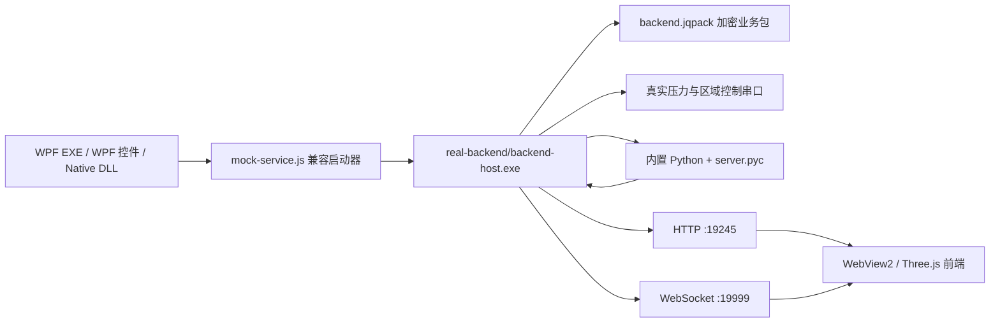

# 真实架构与客户 SDK 转换说明

本文描述 `customer-sdk` 的独立运行和源码保护结构。客户不需要原项目源码，也不需要另外安装 Node.js 或 Python。

## 1. 运行架构



`mock-service.js` 只是兼容已有 WPF 和 Native DLL 启动接口的薄启动器，不生成假数据。它优先启动受保护的 `backend-host.exe`；项目开发环境没有保护产物时，才回退到根目录源码。

## 2. 客户包结构

```text
customer-sdk/
  app/                             WPF 独立程序
  wpf-control/                     WPF 自定义控件 DLL
  native-dll/                      C ABI Native DLL 和 P/Invoke 示例
  mock-service/                    可单独启动的兼容入口
  frontend-build/                  React/Three.js 构建产物和模型
  runtime/node/node.exe            启动薄入口所需的 Node.js
  real-backend/
    backend-host.exe               Node.js SEA 业务宿主
    backend.jqpack                 AES-256-GCM 加密业务模块
    protection-manifest.json       不含密钥的保护产物清单
    python/Python311/              Python 3.11 运行时和第三方依赖
    python/app/*.pyc               第一方汽车自适应算法字节码
    python/app/sensor_config.yaml  客户可调算法参数
    node_modules/                  Node 生产依赖和原生扩展
    db/                            汽车自适应 SQLite 数据库
    data/                          采集输出目录
    config.txt                     系统类型和串口协议配置
  scripts/                         启动、停止和验收脚本
  docs/                            接口、架构和保护说明
```

客户包不包含第一方 `server/*.js`、`util/*.js`、`pyWorker.js` 或算法 `.py`。`node_modules`、Python 标准库和第三方包仍可能包含其各自源码，这是运行时依赖，不是本项目业务源码。

## 3. 真实双传感器链路

1. WPF 或 Native DLL 使用内置 Node 启动 `mock-service.js`。
2. 启动器通过 `JQTOOLS_REAL_BACKEND_ROOT` 定位 `real-backend/`，以隐藏窗口启动 `backend-host.exe`。
3. SEA 宿主在内存中校验并解密 `backend.jqpack`，加载真实 HTTP、WebSocket、串口和 Python 桥接逻辑。
4. 串口按 145 字节解析：首字节 `1` 为主驾、`2` 为副驾，后 144 字节为压力数据。
5. 主、副数据始终进入各自独立的 Python 算法实例，不因 UI 当前显示通道而停止。
6. 两路算法分别返回 55 字节 `control_command`；`auto` 模式下 Node 按来源串口排队写回。
7. WebSocket 用 `carAdaptiveSensorsData` 同时推送两套完整快照。
8. 前端“主驾 / 副驾”按钮只切换本地显示缓存，不清空算法历史，也不影响其他客户端。

气囊写入模式由 `GET`/`POST /carAdaptive/mode` 管理。`manual` 只关闭算法的周期自动写入，
主副两套算法仍逐帧运行；显式 `/carAdaptive/writeCommand` 继续可用。模式变化通过
`carAdaptiveControlMode` 广播。

## 4. Python 调用

Node 启动以下入口：

```text
real-backend/python/Python311/python.exe
real-backend/python/app/server.pyc
```

通信仍为 stdin/stdout JSON 行协议：

```json
{"id":1,"fn":"server","args":{"sensor_id":1,"sensor_data":[144点数据]}}
```

```json
{"id":1,"ok":true,"data":{"control_command":[55字节命令]}}
```

Python 进程使用隐藏窗口启动。WPF 退出时会终止启动器、SEA 宿主和 Python 子进程树。

## 5. 算法参数

参数文件保持明文，以支持客户现场调节：

```text
real-backend/python/app/sensor_config.yaml
```

接口：

```text
GET  /algorithm/config
POST /algorithm/config
```

保存后会重建主、副两套算法实例，新参数立即作用于后续压力帧。

## 6. 从源码到 SDK

`netsdk/build-customer-sdk.ps1` 默认执行：

1. 构建当前 React/Three.js 前端。
2. 构建 WPF 程序、WPF 控件 DLL 和 Native DLL。
3. 安装真实后端生产依赖并复制 Node/Python 运行时。
4. 将第一方 Node 模块压缩后使用 AES-256-GCM 加密为 `backend.jqpack`。
5. 用 Node.js Single Executable Applications 生成 `backend-host.exe`，密钥只随宿主二进制交付。
6. 将五个第一方 Python 算法模块编译成根目录 sourceless `.pyc`。
7. 成功生成全部保护产物后，删除客户包中的第一方 `.js` 和 `.py`。
8. 从 `sdk/API.md`、`sdk/QUICKSTART.md` 复制客户接口文档，再复制其余说明、启动脚本和验收脚本。

内部排查时可临时使用 `-SkipProtection` 输出源码版，但该参数不应用于客户交付。

## 7. 局域网模块控制

后端新增独立于压力数据流的 UI 控制状态：

```text
GET  /carAdaptive/ui/state
POST /carAdaptive/ui/command
```

SDK 业务页通过现有 WebSocket 以 `role=ui-display` 注册，接收 `carAdaptiveUiCommand` 后执行页面导航或本地主副驾切换，并返回 `carAdaptiveUiAcknowledgement`。远程控制不会改变两套后端算法的运行状态。

使用 `/app?remoteControl=1&showTitle=1` 时，iPad 加载与 WPF 完全相同的业务前端；已有主副驾控件会把选择写入控制接口，后端再同步广播给全部显示端。普通 `/app` 仍保持本地展示切换。

`return-home` 可携带启动时配置的 `JQTOOLS_HOME_URL`。网页端直接跳转该地址；WPF 页面同时通过 WebView2 `postMessage` 进入 `CarAdaptiveDebugControl`，再转换为 `HomeRequested` 事件。客户既可配置网页路由，也可由原生宿主决定实际主页。

独立局域网调试页为：

```text
http://<SDK电脑IP>:19245/app#/remote-control
```

控制写接口可通过 `JQTOOLS_REMOTE_CONTROL_TOKEN` 或 WPF `RemoteControlToken` 启用口令验证。完整协议见 `docs/REMOTE_CONTROL.md`。

客户快速接入见 `docs/QUICKSTART.md`，完整业务接口见 `docs/API.md`，真实后端调用边界
补充见 `docs/REAL_API.md`。其中
`POST /carAdaptive/writeCommand` 的成功响应只表示命令进入写入流程，不代表硬件 ACK。

## 8. 验收

```powershell
powershell -ExecutionPolicy Bypass -File .\scripts\verify-sdk.ps1
```

脚本会检查保护产物存在、第一方明文源码不存在，并实际验证 `/health`、`/app`、
`/getPort`、`/algorithm/config`、主副两路算法、自动/手动控制模式，以及局域网控制命令
的 WebSocket 广播和页面回执。只有添加 `-ConnectSerial` 才会执行真实串口连接。

源码保护的强度与边界见 `docs/PROTECTION.md`。
