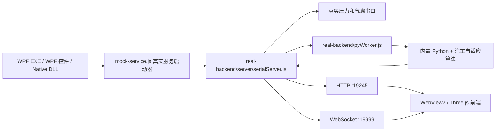

# 真实架构与客户 SDK 转换说明

本文档描述 `customer-sdk` 当前的独立运行架构。客户不需要原项目源码，也不需要另外安装 Node.js 或 Python。

## 1. 运行架构



`mock-service.js` 是为兼容原 WPF 启动接口而保留的文件名。当前文件只负责启动真实后端，不生成假串口或假算法数据。

## 2. 客户包结构

```text
customer-sdk/
  app/                       WPF 独立启动程序
    mock-sdk/                真实服务启动器
  wpf-control/               WPF 自定义控件 DLL
    mock-sdk/                真实服务启动器
  native-dll/                C ABI Native DLL 和 P/Invoke 示例
    mock-sdk/                真实服务启动器
  mock-service/              可单独启动的真实服务入口
  frontend-build/            当前 React/Three.js 构建产物和模型
  runtime/node/node.exe      内置 Node.js
  real-backend/
    server/                  HTTP、WS、串口和算法调用
    util/                    串口解析、数据库和配置工具
    pyWorker.js              Node/Python JSON 行协议桥接
    python/Python311/        内置 Python 运行时和依赖
    python/app/              汽车自适应算法及 YAML 配置
    node_modules/            Node 生产依赖
    db/                      汽车自适应 SQLite 数据库
    data/                    采集输出目录
    config.txt               系统类型和串口协议配置
  scripts/                   启动、停止和验收脚本
  docs/                      接口和架构文档
```

所有入口共享一份 `real-backend/` 和 `frontend-build/`，避免重复拷贝 Python、Node 依赖和 Three.js 模型。

## 3. 真实数据链路

1. WPF 或 Native DLL 使用 `runtime/node/node.exe` 启动入口。
2. 入口通过 `JQTOOLS_REAL_BACKEND_ROOT` 定位客户包内的 `real-backend/`。
3. `serialServer.js` 读取本机真实串口并解析 144 点汽车压力帧。
4. Node 通过 `pyWorker.js` 向常驻 Python 进程发送 JSON 行请求。
5. Python 调用 `IntegratedSeatSystem.process_frame()` 生成算法数据和 51 字节 `control_command`。
6. Node 将控制命令写回 `carAir` 气囊串口，并通过 WebSocket 推送真实数据。
7. WebView2 加载 `/app`，显示当前 React/Three.js 前端。

## 4. Python 调用协议

请求示例：

```json
{"id":1,"fn":"server","args":{"sensor_data":[0,1,2]}}
```

响应示例：

```json
{"id":1,"ok":true,"data":{"control_command":[170,85]}}
```

Python 进程使用隐藏窗口启动，WPF 正常运行时不会出现终端窗口。WPF 退出时会终止入口和其子进程树。

## 5. 算法参数

参数源文件：

```text
real-backend/python/app/sensor_config.yaml
```

接口：

```text
GET  /algorithm/config
POST /algorithm/config
```

前端右上角“算法参数”按钮会打开抽屉，按配置段分组显示全部参数及中文注释。保存时前端只发送已修改项；Python 合并写入 YAML 后重建算法系统，使映射参数和未映射参数都立即生效。

## 6. 从源码到 SDK 的转换

`netsdk/build-customer-sdk.ps1` 执行以下工作：

1. 构建 `client/`，生成当前前端和 Three.js 模型资源。
2. 构建 WPF 程序、WPF 控件 DLL 和 Native DLL。
3. 复制真实 Node 后端、串口工具、汽车数据库和算法代码到 `real-backend/`。
4. 复制 Python 3.11 运行时及算法依赖。
5. 使用 `npm ci --omit=dev` 安装 Node 生产依赖。
6. 复制当前 `node.exe` 到 `runtime/node/`。
7. 生成客户文档、启动脚本和验收脚本。

## 7. 验证边界

执行：

```powershell
powershell -ExecutionPolicy Bypass -File .\scripts\verify-sdk.ps1
```

验收脚本会检查内置 Node、Python、真实后端、前端、Three.js 模型、WPF DLL 和 Native DLL，并实际调用 `/health`、`/getPort`、`/algorithm/config`。添加 `-ConnectSerial` 后才会执行真实串口连接，避免基础验收误操作硬件。
