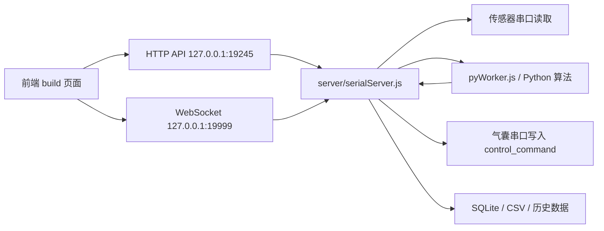
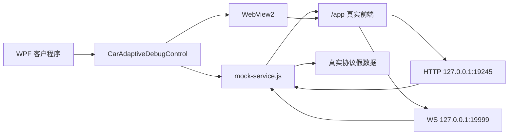

# 真实架构与客户 SDK 转换说明

本文档说明当前项目真实运行架构、客户版 SDK 的交付架构，以及从真实项目转换成可交付 SDK 时做了哪些映射。

## 1. 原项目真实架构

原项目是一个本地桌面系统，核心由四部分组成：

```text
Electron 主进程
  ├─ 本地静态前端服务：加载 build/
  ├─ Node.js 后端服务：server/serialServer.js
  ├─ Python 算法 worker：pyWorker.js 调用 python/
  └─ 串口设备：serialport 读传感器、写气囊控制命令
```

真实运行链路如下：



### 1.1 前端

真实前端来自项目根目录：

```text
build/
  index.html
  static/
  model/
```

前端里会直接访问：

```text
HTTP: http://localhost:19245
WS:   ws://127.0.0.1:19999
```

Three.js 模型资源在：

```text
build/model/
```

所以前端必须通过 HTTP 服务加载，不能简单用 `file://` 打开，否则 Three.js 模型、贴图、跨域请求和 WebSocket 链路都容易出问题。

### 1.2 后端

真实后端入口是：

```text
server/serialServer.js
```

它负责：

- 提供 REST API，默认端口 `19245`。
- 提供 WebSocket 推送，默认端口 `19999`。
- 读取传感器串口数据。
- 解析汽车自适应 144 点压力数据。
- 调用 Python 算法。
- 将算法返回的 `control_command` 写回气囊串口。
- 保存 SQLite、CSV、历史回放等数据。

### 1.3 Python 算法

Node.js 通过 `pyWorker.js` 和 Python 算法进程通信，通信方式是 stdin/stdout JSON 行协议。

汽车自适应链路核心是：

```text
串口 144 点压力数据
  -> Node.js 后端
  -> pyWorker.js
  -> Python 算法
  -> control_command
  -> Node.js 后端
  -> 气囊串口写入
```

### 1.4 真实 WebSocket 协议

前端真实依赖的推送格式包括：

```json
{}
```

```json
{
  "sitData": {
    "carAir": {
      "arr": [144]
    }
  }
}
```

```json
{
  "algorFeed": [24]
}
```

```json
{
  "algorData": {
    "sensor_data_144": [144],
    "control_command": [51],
    "control_command_51": [51]
  }
}
```

说明：

- `sitData.carAir.arr` 是 144 点压力数据。
- `algorData.sensor_data_144` 是算法输入/展示用的 144 点压力数据。
- `control_command` 是 51 字节气囊控制命令。
- `algorFeed` 是 24 路控制反馈。

## 2. 客户 SDK 交付架构

客户版 SDK 的目标不是暴露一组普通函数，而是交付一个客户可以直接启动、WPF 可以加载、接口可以验证的本地服务包。

当前输出目录：

```text
netsdk/customer-sdk/
  app/
  mock-service/
  frontend-build/
  wpf-control/
  native-dll/
  docs/
  scripts/
```

客户侧默认运行：

```text
app/JqTools.CarAdaptive.ClientWpf.exe
```

启动后的链路是：



## 3. 转换方式

### 3.1 前端转换

真实项目前端没有重写，直接复用项目当前 `build/`。

转换规则：

```text
项目 build/
  -> netsdk/customer-sdk/frontend-build/
```

mock 服务新增静态资源入口：

```text
GET /app
GET /static/...
GET /model/...
GET /asset-manifest.json
GET /manifest.json
GET /favicon.ico
```

这样真实前端仍然按原来的路径加载资源，Three.js 仍然可以通过 HTTP 获取 `.glb`、`.fbx` 和贴图。

### 3.2 端口转换

因为真实前端已经写死或默认使用：

```text
HTTP: 19245
WS:   19999
```

所以客户版 WPF 默认也使用这两个端口，保证真实前端不需要改代码。

WPF 启动配置：

```xml
<jq:CarAdaptiveDebugControl
    AutoStartService="True"
    Host="127.0.0.1"
    HttpPort="19245"
    WebSocketPort="19999"
    PagePath="/app" />
```

### 3.3 后端转换

客户调试版没有接真实串口，也没有直接跑真实 Python 算法，而是用 `mock-service.js` 模拟真实后端协议。

转换关系：

```text
真实 server/serialServer.js
  -> 客户 mock-service/mock-service.js
```

保留的部分：

- HTTP 服务。
- WebSocket 服务。
- 前端需要的接口入口。
- 真实 WebSocket 数据结构。
- 144 点压力数据。
- 51 字节气囊控制命令。
- 自适应调节开关。
- 气囊控制发送和返回数据。

替换的部分：

- 串口硬件读取替换成假数据生成。
- Python 算法输出替换成假算法数据生成。
- 气囊串口写入替换成接口回包和 WS 反馈。

### 3.4 WebSocket 协议转换

真实前端最关心的是 WS 数据结构，所以 mock 服务按真实协议推送，而不是自定义调试协议。

转换前早期调试格式类似：

```json
{
  "type": "algorithm",
  "payload": {}
}
```

转换后客户 SDK 使用真实格式：

```json
{
  "algorData": {}
}
```

也就是说，客户 SDK 里推送的是前端真实已经跑通过的字段：

```text
{}
{ sitData }
{ algorFeed }
{ algorData }
```

### 3.5 WPF 控件转换

WPF 控件库输出：

```text
wpf-control/JqTools.CarAdaptive.Wpf.dll
```

核心类：

```text
CarAdaptiveDebugControl
CarAdaptiveMockServiceHost
CarAdaptiveDebugOptions
```

转换逻辑：

1. WPF 控件加载时启动 Node.js mock 服务。
2. 启动服务时注入端口环境变量。
3. 启动服务时注入真实前端目录 `JQTOOLS_MOCK_FRONTEND_DIR`。
4. WebView2 加载 `http://127.0.0.1:19245/app`。
5. WPF 退出或控件卸载时关闭服务。

关键环境变量：

```text
JQTOOLS_MOCK_HOST=127.0.0.1
JQTOOLS_MOCK_HTTP_PORT=19245
JQTOOLS_MOCK_WS_PORT=19999
JQTOOLS_MOCK_FRONTEND_DIR=customer-sdk/frontend-build
```

### 3.6 Native DLL 转换

Native DLL 输出：

```text
native-dll/JqToolsCarAdaptiveNative.dll
```

它提供 C ABI 给 WPF P/Invoke 调用，职责是：

- 启动 `mock-service.js`。
- 停止服务。
- 返回 `/app` 页面地址。
- 打开页面。

Native DLL 也会解析并传入：

```text
JQTOOLS_MOCK_FRONTEND_DIR
```

所以 Native DLL 方案和 WPF 控件方案加载的是同一份真实前端。

## 4. 打包输出流程

生成脚本：

```text
netsdk/build-customer-sdk.ps1
```

完整构建时会做：

```text
1. npm install mock-sdk
2. dotnet build WPF 控件
3. dotnet build WPF 启动程序
4. cmake build Native DLL
5. 复制 build/ 到 customer-sdk/frontend-build/
6. 复制 WPF app 到 customer-sdk/app/
7. 复制 mock-service 到 customer-sdk/mock-service/
8. 复制 WPF 控件到 customer-sdk/wpf-control/
9. 复制 Native DLL 到 customer-sdk/native-dll/
10. 复制 docs 和 scripts
```

只重新整理输出、不重新编译：

```powershell
powershell -ExecutionPolicy Bypass -File .\netsdk\build-customer-sdk.ps1 -SkipBuild
```

## 5. 客户验证方式

客户直接启动：

```powershell
.\app\JqTools.CarAdaptive.ClientWpf.exe
```

或启动独立服务：

```powershell
powershell -ExecutionPolicy Bypass -File .\scripts\start-mock-service.ps1
```

验证完整链路：

```powershell
powershell -ExecutionPolicy Bypass -File .\scripts\verify-sdk.ps1
```

验收脚本验证内容：

- `app/JqTools.CarAdaptive.ClientWpf.exe` 存在。
- `wpf-control/JqTools.CarAdaptive.Wpf.dll` 存在。
- `native-dll/JqToolsCarAdaptiveNative.dll` 存在。
- `frontend-build/index.html` 存在。
- `frontend-build/model/seat2.glb` 存在。
- `GET /health` 正常。
- `GET /app` 返回真实前端。
- `HEAD /model/seat2.glb` 可以访问模型资源。
- `POST /fake/connect` 可以一键假连接。
- WebSocket 能收到 `{}`、`{ sitData }`、`{ algorFeed }`、`{ algorData }`。

## 6. 交付边界

当前客户 SDK 是“真实前端 + 真实协议 + 假硬件/假算法数据”的调试交付包。

它适合验证：

- WPF 能否加载。
- WebView2 能否显示 Three.js 前端。
- HTTP/WS 端口链路是否通。
- 真实前端是否能消费 144 和 51 长度数据。
- 客户自己的 WPF 项目能否引用 DLL 或 Native DLL。

它不等同于真实生产后端：

- 不连接真实串口设备。
- 不调用真实 Python 算法包。
- 不写真实气囊串口。
- 不保存真实采集数据库。

如果后续要把客户 SDK 从假数据版升级成真实后端版，需要把 `mock-service.js` 替换为真实 `server/serialServer.js` 及其依赖，并一起交付 Python 算法、串口配置、数据库目录和运行时环境。

