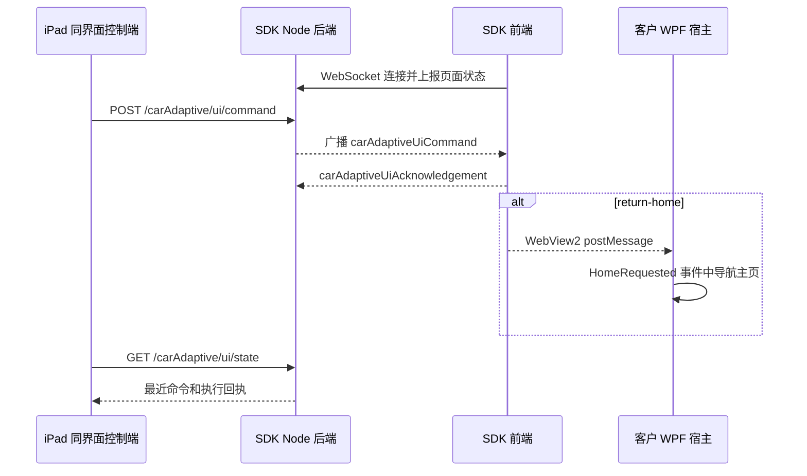

# 汽车自适应 SDK 局域网远程控制

该功能用于汽车自适应 SDK 作为客户主程序中的一个模块时，由局域网内另一台设备控制：

- 返回客户主程序主页
- 打开汽车自适应模块
- 打开串口原始数据页
- 切换当前展示的主驾或副驾数据

远程切换只影响前端展示。主驾标识符 `1` 和副驾标识符 `2` 的串口数据、Python 算法实例和区域控制命令始终独立运行，不会因页面切换而暂停。

本功能没有在现有汽车自适应页面增加按钮或修改布局。iPad 可以使用同一业务界面作为控制端，也可以使用独立调试控制页。

## 1. iPad 同界面控制

SDK 服务启动后，在同一局域网的 iPad 浏览器打开：

```text
http://<SDK电脑IP>:19245/app?remoteControl=1&showTitle=1
```

例如：

```text
http://192.168.1.20:19245/app?remoteControl=1&showTitle=1
```

该地址加载的就是 WPF 中同一份 `frontend-build` 业务界面，不是另一套页面：

- 点击已有的“主驾 / 副驾”分段按钮，会通过 `POST /carAdaptive/ui/command` 广播到 WPF、iPad 和其他显示端。
- 点击左上角 Faway 标识，会广播 `return-home`。
- 从原始数据页返回时，会广播 `open-module`。
- 普通 `/app` 不带 `remoteControl=1` 时仍只切换当前页面，不会广播。

完整标题栏默认隐藏，因此 iPad 地址应带 `showTitle=1`。页面右上角原有透明热区仍可临时显示或隐藏标题栏。

## 2. 独立调试页

SDK 服务启动后，在同一局域网设备上打开：

```text
http://<SDK电脑IP>:19245/app#/remote-control
```

例如：

```text
http://192.168.1.20:19245/app#/remote-control
```

调试页会显示 SDK 页面连接数、当前页面、当前主副驾、最近命令和页面执行回执。

如无法访问，请确认：

1. 两台设备处于同一局域网。
2. SDK 电脑的 Windows 防火墙允许专用网络访问 TCP `19245` 和 `19999`。
3. SDK 服务正在运行，且端口未被其他程序占用。

## 3. HTTP 接口

### 查询状态

```http
GET /carAdaptive/ui/state
```

响应中的主要字段：

| 字段 | 说明 |
| --- | --- |
| `selectedSensorId` | 当前展示通道，`1` 主驾，`2` 副驾 |
| `view` | `module`、`raw-serial`、`host-home` 或 `other` |
| `displayClients` | 当前连接的 SDK 显示端数量 |
| `sequence` | 已下发命令序号 |
| `lastCommand` | 最近下发的命令 |
| `lastAcknowledgement` | SDK 页面最近一次执行回执 |
| `lanAddresses` | SDK 电脑可用的局域网 IPv4 地址 |
| `tokenRequired` | 写控制接口是否要求口令 |
| `homeUrlConfigured` | SDK 是否已配置网页主页地址 |

### 下发命令

```http
POST /carAdaptive/ui/command
Content-Type: application/json
```

返回客户主程序主页：

```json
{ "action": "return-home" }
```

打开汽车自适应模块：

```json
{ "action": "open-module" }
```

打开串口原始数据页：

```json
{ "action": "open-raw-serial" }
```

切换主驾：

```json
{ "action": "select-sensor", "sensorId": 1 }
```

切换副驾：

```json
{ "action": "select-sensor", "sensorId": 2 }
```

PowerShell 调用示例：

```powershell
$body = @{ action = "select-sensor"; sensorId = 2 } |
    ConvertTo-Json -Compress

Invoke-RestMethod `
    -Uri "http://192.168.1.20:19245/carAdaptive/ui/command" `
    -Method Post `
    -ContentType "application/json" `
    -Body $body
```

## 4. 配置返回主页

网页或 iPad 的主页地址可以在 SDK 启动时统一配置：

```powershell
powershell -ExecutionPolicy Bypass `
    -File .\scripts\start-wpf.ps1 `
    -HomeUrl "https://customer.example/home"
```

独立后端：

```powershell
powershell -ExecutionPolicy Bypass `
    -File .\scripts\start-mock-service.ps1 `
    -HomeUrl "https://customer.example/home"
```

WPF 控件：

```xml
<jq:CarAdaptiveDebugControl
    HomeUrl="https://customer.example/home" />
```

`HomeUrl` 会写入后端配置并随 `return-home` 广播，所以 WPF WebView 和 iPad 都会收到同一目标。某台设备需要不同主页时，可在该设备 URL 上使用 `homeUrl` 查询参数覆盖：

```text
http://192.168.1.20:19245/app?remoteControl=1&showTitle=1&homeUrl=https%3A%2F%2Fipad.example%2Fhome
```

主页地址优先级为：当前页面 `homeUrl` 查询参数、后端广播的 `HomeUrl`、SDK 模块首页 `/`。

### 原生 WPF 主页

`return-home` 不假设客户主程序的主页类型。SDK 页面通过 WebView2 消息通知 `CarAdaptiveDebugControl`，控件再触发 `HomeRequested` .NET 事件，由客户主程序执行实际导航。

XAML：

```xml
<jq:CarAdaptiveDebugControl
    x:Name="CarAdaptiveControl"
    AutoStartService="True"
    StopServiceOnUnload="True"
    HomeUrl="https://customer.example/home"
    HomeRequested="HandleCarAdaptiveHomeRequested" />
```

C#：

```csharp
private void HandleCarAdaptiveHomeRequested(
    object? sender,
    CarAdaptiveHomeRequestedEventArgs e)
{
    MainFrame.Navigate(new HomePage());
}
```

事件参数包含：

- `CommandId`：远程命令编号
- `Source`：消息来源
- `HomeUrl`：SDK 配置的网页主页地址或路由
- `RequestedAt`：页面发起请求的时间

如果网页不在 WPF 控件中，页面还会：

- 触发 DOM 事件 `jqtools:car-adaptive-home-requested`
- 向父窗口发送同名消息对象
- 存在 `homeUrl` 查询参数时跳转到该地址
- 无宿主处理时回到 SDK 模块首页

## 5. 可选控制口令

未设置口令时，局域网内设备可直接调用 `POST /carAdaptive/ui/command`。生产环境建议设置口令。

独立 WPF 程序：

```powershell
powershell -ExecutionPolicy Bypass `
    -File .\scripts\start-wpf.ps1 `
    -RemoteControlToken "customer-secret"
```

独立后端：

```powershell
powershell -ExecutionPolicy Bypass `
    -File .\scripts\start-mock-service.ps1 `
    -RemoteControlToken "customer-secret"
```

客户 WPF 控件：

```xml
<jq:CarAdaptiveDebugControl
    RemoteControlToken="customer-secret" />
```

调用接口时把同一口令放入请求头：

```http
X-JQTools-Control-Token: customer-secret
```

调试页右侧“控制令牌”输入框只保存在当前浏览器会话中，不写入 SDK 配置文件。

同界面控制端会读取相同的会话口令。快速联调也可在地址中增加 `controlToken` 查询参数，但生产环境不建议把长期口令保存在 URL 中。

## 6. 通信流程



## 7. 自动验收

```powershell
powershell -ExecutionPolicy Bypass -File .\scripts\verify-sdk.ps1
```

验收脚本会建立一个 SDK 显示端 WebSocket，调用远程切换和返回主页接口，确认主副驾广播、页面执行回执以及配置主页地址都已正确下发。
